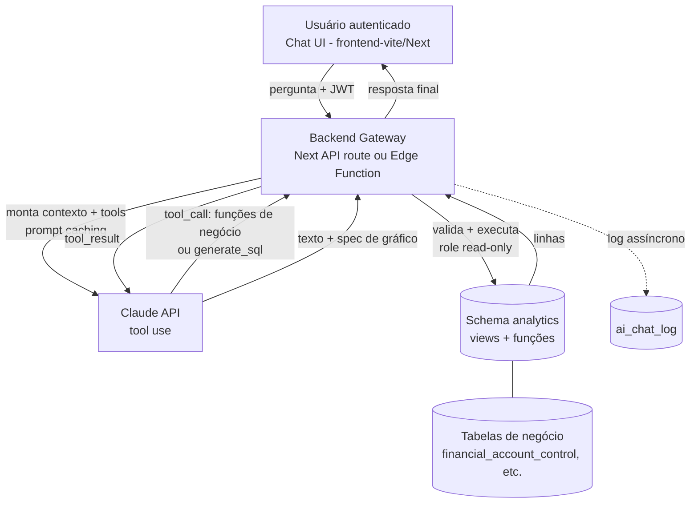

# Arquitetura — Chat de IA para Análise de Pagamentos

**Projeto:** Pagamentos · **Documento:** desenho de arquitetura (fase de design, _antes_ de tocar no banco)
**Data:** 2026-07-27 · **Status:** proposta para revisão

> Este documento define a arquitetura de um chat de IA **embarcado no app** para análise
> conversacional dos dados de contas a pagar armazenados no Supabase (PostgreSQL). Nada aqui
> deve ser aplicado no banco ainda — as views, roles e DDL são **propostas** a validar contra
> o schema real numa fase seguinte.

---

## 1. Objetivo e escopo

Permitir que um usuário autenticado do app faça perguntas em linguagem natural sobre os
pagamentos ("quanto paguei por fornecedor em junho?", "qual o aging dos vencidos?", "top 10
fornecedores por valor no trimestre") e receba resposta em texto + tabela/gráfico, com o SQL
executado de forma **segura, auditável e read-only** sobre o Postgres do Supabase.

**Dentro do escopo:** consulta analítica read-only, agregações, séries temporais, rankings,
detalhamento (drill-down) sob demanda.

**Fora do escopo (v1):** qualquer escrita/alteração de dados, ações operacionais (dar baixa,
enviar cobrança), previsões/forecast estatístico, acesso a dados fora do domínio de pagamentos.

---

## 2. Princípios de design

1. **Security-first.** O caminho do chat nunca usa `service_role`. Acesso via role dedicada
   **read-only**, exposta apenas a um schema `analytics` de views curadas. RLS respeitado.
2. **Semantic layer antes de SQL livre.** O modelo prefere **ferramentas parametrizadas**
   (tool calling) sobre views de negócio; text-to-SQL é fallback controlado para perguntas
   abertas, nunca a via primária.
3. **Rastreabilidade total.** Toda interação (pergunta → tool/SQL → resultado → resposta) é
   logada para auditoria e melhoria contínua — alinhado ao padrão de logging/rastreabilidade
   do projeto.
4. **Custo previsível.** Prompt caching do schema/dicionário; agregações pré-computadas em
   views (ou materialized views) para não reprocessar em toda pergunta.
5. **Chave natural vs. técnica preservada.** A camada semântica expõe dimensões pela chave de
   negócio legível (fornecedor, empresa, status), resolvendo `sk_` internamente.

---

## 3. Visão geral do fluxo



Regra de ouro: **o browser nunca fala com a Claude API nem com o banco diretamente.** Todo o
tráfego passa pelo gateway server-side, único detentor da `ANTHROPIC_API_KEY` e da conexão
com a role read-only.

---

## 4. Componentes

### 4.1 Frontend — Chat UI
- Componente de chat no `frontend-vite` (React 18) ou nos apps Next, reaproveitando o design
  system existente (Atomic Design + Tailwind, tokens `status`/`loginGreen`).
- Renderiza: mensagens, tabela de resultado, gráfico (Recharts/similar a partir de uma
  `chart_spec` devolvida pelo backend) e o **SQL/ferramenta usada** (transparência opcional).
- Envia apenas: texto da pergunta + histórico curto da conversa. Autenticação via JWT do
  Supabase Auth já existente.

### 4.2 Backend Gateway (orquestrador)
- **Onde:** rota na Next API (`apps/api-backend`) **ou** Supabase Edge Function. Recomendação:
  Next API, por já centralizar o envelope `{ success, data, error }` e o acesso a segredos.
- **Responsabilidades:**
  1. Validar JWT e identificar o usuário (para RLS).
  2. Montar o system prompt + dicionário de dados + definição das tools (com prompt caching).
  3. Rodar o **loop de tool use** com a Claude API.
  4. **Validar e executar** cada tool call contra o schema `analytics` com a role read-only.
  5. Formatar a resposta (`{ answer, table, chart_spec, sql_executed, tool_calls }`).
  6. Logar a interação de forma assíncrona.

### 4.3 Camada de IA (Claude API)
- Modelo Claude via Anthropic API (a mesma conta já em uso no projeto).
- **Tool use** como mecanismo central. O modelo escolhe entre funções de negócio; se nenhuma
  serve, chama `generate_sql` (text-to-SQL) sob guardrails.
- **Prompt caching** (`cache_control`) no bloco de schema + dicionário + few-shot — reduz
  drasticamente o custo por pergunta (você já domina esse padrão).

### 4.4 Camada semântica (`analytics`)
- Um schema **`analytics`** dedicado, contendo **apenas views/funções de leitura** curadas.
- A role read-only enxerga **só** esse schema — nunca as tabelas base diretamente.
- Duas formas de exposição:
  - **Funções de negócio** (parametrizadas) → mapeadas 1:1 para tools do modelo.
  - **Views planas** (fact + dimensões já resolvidas) → alvo do text-to-SQL de fallback.

### 4.5 Acesso a dados (role read-only + RLS)
- Role `ai_readonly` (`NOLOGIN`, herdada por um usuário de serviço do gateway), com `SELECT`
  apenas no schema `analytics`, `statement_timeout` curto e sem qualquer grant de escrita.
- RLS das tabelas base continua valendo; as views são `security_invoker` para herdar o
  contexto do usuário autenticado.

### 4.6 Observabilidade / auditoria
- Tabela `ai_chat_log` registrando: usuário, timestamp, pergunta, tools/SQL executados,
  nº de linhas, latência, tokens/custo, erro (se houver). Base para auditoria, tuning de
  few-shot e detecção de abuso.

---

## 5. Fluxo detalhado de uma pergunta

1. Usuário envia "aging dos vencidos por empresa".
2. Gateway valida JWT, monta o request com system prompt + dicionário + tools (blocos cacheados).
3. Claude responde com um `tool_call` → `aging_vencidos(group_by='empresa')`.
4. Gateway valida os parâmetros contra o JSON Schema da tool, executa a função em `analytics`
   com a role read-only (timeout + LIMIT aplicados).
5. Gateway devolve o `tool_result` (linhas) ao modelo.
6. Claude gera a resposta em texto + uma `chart_spec` (tipo de gráfico, eixos, séries).
7. Gateway formata `{ answer, table, chart_spec, tool_calls }`, loga a interação e responde ao
   frontend, que renderiza texto + gráfico.

Para uma pergunta aberta que não casa com nenhuma função, o passo 3 vira `generate_sql`, e o
passo 4 acrescenta a **validação de SQL** (seção 8) antes de executar.

---

## 6. Contrato das ferramentas (tool calling)

Definições enviadas ao modelo. Exemplos (JSON Schema resumido):

```jsonc
[
  {
    "name": "gasto_por_periodo",
    "description": "Total de contas a pagar agregado por período. Use para 'quanto paguei/devo em X'.",
    "input_schema": {
      "type": "object",
      "properties": {
        "date_from": { "type": "string", "format": "date" },
        "date_to":   { "type": "string", "format": "date" },
        "date_field":{ "type": "string", "enum": ["vencimento", "pagamento", "emissao"] },
        "granularity":{ "type": "string", "enum": ["dia", "semana", "mes", "trimestre"] },
        "status":    { "type": "array", "items": { "type": "string" } }
      },
      "required": ["date_from", "date_to", "date_field"]
    }
  },
  {
    "name": "gasto_por_fornecedor",
    "description": "Ranking/total por fornecedor. Use para 'top fornecedores', 'quanto para o fornecedor X'.",
    "input_schema": {
      "type": "object",
      "properties": {
        "date_from": { "type": "string", "format": "date" },
        "date_to":   { "type": "string", "format": "date" },
        "supplier":  { "type": "string" },
        "sk_company":{ "type": "integer" },
        "limit":     { "type": "integer", "maximum": 100, "default": 20 }
      },
      "required": ["date_from", "date_to"]
    }
  },
  {
    "name": "aging_vencidos",
    "description": "Aging de títulos vencidos por faixa (0-30, 31-60, 61-90, 90+).",
    "input_schema": {
      "type": "object",
      "properties": {
        "as_of":    { "type": "string", "format": "date" },
        "group_by": { "type": "string", "enum": ["empresa", "fornecedor", "faixa"] }
      }
    }
  },
  {
    "name": "generate_sql",
    "description": "FALLBACK. Só quando nenhuma função de negócio atende. Gera um SELECT sobre o schema analytics.",
    "input_schema": {
      "type": "object",
      "properties": { "sql": { "type": "string" }, "rationale": { "type": "string" } },
      "required": ["sql", "rationale"]
    }
  }
]
```

Cada função de negócio é implementada como uma **view/função SQL em `analytics`** — o gateway
nunca interpola strings do modelo em SQL nas funções parametrizadas (apenas binds).

---

## 7. Modelo de dados de apoio (proposta — não aplicar ainda)

> Nomes das tabelas base conforme os docs do projeto (`financial_account_control`, dimensões de
> fornecedor/empresa/status). **A validar** contra o schema real na próxima fase.

Schema dedicado e uma view "fact" plana com dimensões já resolvidas (chave natural exposta):

```sql
-- PROPOSTA — revisar contra o schema real antes de aplicar
CREATE SCHEMA IF NOT EXISTS analytics;

-- Fact planar de contas a pagar, dimensões resolvidas por chave natural legível
CREATE OR REPLACE VIEW analytics.vw_payables
WITH (security_invoker = true) AS
SELECT
    f.id                       AS payable_id,
    f.sk_company,
    c.company_name,            -- dimensão empresa (natural key exposta)
    f.supplier_id,
    s.supplier_name,           -- dimensão fornecedor
    st.status_name,            -- status como dimensão
    f.issue_date,
    f.due_date,
    f.payment_date,
    f.amount
FROM financial_account_control f
JOIN dim_company  c  ON c.sk_company = f.sk_company
LEFT JOIN dim_supplier s ON s.supplier_id = f.supplier_id
JOIN dim_status   st ON st.status_id  = f.status_id;

-- Exemplo de view de negócio (aging), alvo da tool aging_vencidos
CREATE OR REPLACE VIEW analytics.vw_aging_vencidos
WITH (security_invoker = true) AS
SELECT
    company_name,
    supplier_name,
    CASE
        WHEN CURRENT_DATE - due_date BETWEEN 0  AND 30 THEN '0-30'
        WHEN CURRENT_DATE - due_date BETWEEN 31 AND 60 THEN '31-60'
        WHEN CURRENT_DATE - due_date BETWEEN 61 AND 90 THEN '61-90'
        ELSE '90+'
    END AS faixa,
    SUM(amount) AS total_vencido,
    COUNT(*)    AS qtd
FROM analytics.vw_payables
WHERE status_name = 'vencido'
GROUP BY 1, 2, 3;

-- Tabela de auditoria do chat
CREATE TABLE IF NOT EXISTS analytics.ai_chat_log (
    id           bigint GENERATED ALWAYS AS IDENTITY PRIMARY KEY,
    created_at   timestamptz NOT NULL DEFAULT now(),
    user_id      uuid,
    question     text NOT NULL,
    tool_calls   jsonb,       -- ferramentas/SQL executados
    row_count    integer,
    latency_ms   integer,
    input_tokens integer,
    output_tokens integer,
    error        text
);
```

---

## 8. Guardrails de segurança

- **Role read-only isolada:** `ai_readonly` com `SELECT` só em `analytics`; `REVOKE` de tudo o
  mais. `ALTER ROLE ai_readonly SET statement_timeout = '5s';`.
- **Sem `service_role` no caminho do chat.** A key de serviço nunca é usada aqui.
- **Text-to-SQL sob validação** (`generate_sql`), antes de executar:
  - Aceitar **somente** um único comando `SELECT` (parse/AST; rejeitar `;` múltiplos, DML, DDL,
    `COPY`, funções perigosas).
  - Allowlist de objetos: apenas relações do schema `analytics`.
  - Forçar `LIMIT` (ex.: 1000) e `statement_timeout`.
  - Executar sempre em **transação read-only** (`SET TRANSACTION READ ONLY`).
- **RLS preservado** via views `security_invoker` — o usuário só enxerga o que já poderia ver.
- **Segredos server-side:** `ANTHROPIC_API_KEY` e credencial do banco nunca chegam ao browser.
- **Rate limiting** por usuário e limite de custo/tokens por sessão.
- **Sanitização de saída:** o gateway nunca ecoa credenciais/segredos; erros 5xx não vazam
  detalhe interno (padrão do projeto).

---

## 9. Precisão

- **Dicionário de dados** como contexto do modelo: descrição de cada view/coluna, o significado
  de cada `status`, regras de negócio-chave (ex.: vencimento autoritativo pelo fator do código
  de barras; empresa pagadora por precedência). Você já tem isso documentado — reaproveitar.
- **Few-shot** com 5–10 pares pergunta→tool/SQL reais, evoluídos a partir do `ai_chat_log`.
- **Preferir funções de negócio** (determinísticas) reduz alucinação de SQL.
- **Devolver o SQL/tool ao usuário** (transparência) permite validação humana rápida.
- **Testes de regressão de perguntas:** um conjunto fixo de perguntas com resultado esperado,
  rodado a cada mudança de prompt/schema (alinhado ao "todo componente tem teste").

---

## 10. Custo e performance

- **Prompt caching** do bloco schema+dicionário+tools (estático) → só a pergunta varia; leitura
  de cache custa ~10% do input.
- **Agregações pré-computadas:** views normais para o caso geral; **materialized views**
  (refresh agendado via Task Scheduler, que você já opera) para métricas pesadas/históricas.
- **Limite de linhas** por resposta (paginação/drill-down sob demanda) evita estourar contexto.
- **Modelo por complexidade:** um modelo mais econômico para roteamento/pergunta simples e um
  mais capaz para análise complexa, se quiser otimizar custo (opcional).

---

## 11. Roadmap de implementação (faseado)

1. **Fase 0 — Validação de schema.** Inspecionar o banco real, confirmar nomes/relacionamentos,
   fechar o dicionário de dados.
2. **Fase 1 — Camada semântica.** Criar schema `analytics`, views planas + 3–5 funções de
   negócio, role `ai_readonly`, `ai_chat_log`.
3. **Fase 2 — Gateway + tool use.** Rota Next API com o loop de tool use, prompt caching,
   validação de parâmetros, logging.
4. **Fase 3 — Text-to-SQL fallback.** `generate_sql` com validador de AST e allowlist.
5. **Fase 4 — Frontend.** Componente de chat + render de tabela/gráfico no design system.
6. **Fase 5 — Hardening.** Rate limit, testes de regressão de perguntas, tuning de few-shot,
   materialized views onde necessário.

---

## 12. Riscos e mitigações

| Risco | Mitigação |
|---|---|
| SQL malicioso via text-to-SQL | Validador AST + allowlist + read-only txn + timeout + LIMIT |
| Vazamento de dados entre usuários | RLS + views `security_invoker` |
| Resposta numérica incorreta (alucinação) | Funções determinísticas + transparência do SQL + testes de regressão |
| Custo de tokens crescente | Prompt caching + limites por sessão + views pré-agregadas |
| Exposição de segredos | Tudo server-side; nenhuma key no browser |
| Deriva schema ↔ dicionário | Dicionário versionado junto do schema; teste que compara colunas |

---

## 13. Decisões em aberto (a validar na Fase 0)

- Nomes reais e relacionamentos das dimensões (empresa/`sk_company`, fornecedor, status).
- Existe tabela de dimensão de status ou o status é enum/coluna? (Impacta "status como dimensão".)
- Campo(s) de data disponíveis (emissão, vencimento, pagamento) e sua confiabilidade.
- Volume de dados (define se materialized view é necessária desde já).
- Multi-tenant? (Se houver múltiplas empresas/usuários, RLS precisa de política explícita.)
- Gateway em Next API vs. Edge Function (latência x proximidade do banco).

---

## 14. Pré-requisitos

Já disponível: Postgres estruturado no Supabase, Supabase Auth (JWT), Claude API ativa, backend
(Next API/Flask), design system para a UI, Task Scheduler para refresh de materialized views.

A criar: schema `analytics` + views/funções, role `ai_readonly`, `ai_chat_log`, o gateway de
tool use, o validador de text-to-SQL e o componente de chat no frontend.
