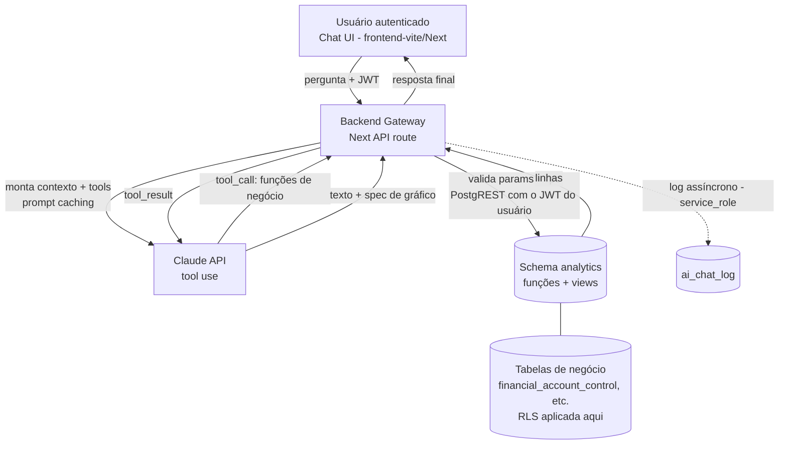

# Arquitetura — Chat de IA para Análise de Pagamentos

**Projeto:** Pagamentos · **Documento:** desenho de arquitetura
**Criado:** 2026-07-27 · **Revisado:** 2026-07-28 (Fase 0) · **Status:** Fase 0 concluída — nada aplicado no banco

> Este documento define a arquitetura de um chat de IA **embarcado no app** para análise
> conversacional dos dados de contas a pagar armazenados no Supabase (PostgreSQL).
>
> **Revisão da Fase 0 (2026-07-28):** o schema real foi inspecionado via Supabase MCP (só
> `SELECT`/introspecção) e as suposições do desenho original foram confrontadas com ele. As views
> e os contratos de tools abaixo **já refletem o schema real** e as DDL do §7 foram validadas
> rodando como consulta ad-hoc. **Continua valendo: nada foi aplicado no banco** — a criação do
> schema `analytics` é a Fase 1. Os achados e o que mudou estão no §13.

---

## 1. Objetivo e escopo

Permitir que um usuário autenticado do app faça perguntas em linguagem natural sobre os
pagamentos ("quanto paguei por fornecedor em junho?", "qual o aging dos vencidos?", "top 10
fornecedores por valor no trimestre") e receba resposta em texto + tabela/gráfico, com a consulta
executada de forma **segura, auditável e read-only** sobre o Postgres do Supabase — e enxergando
**exatamente** o que aquele usuário já veria pela tela.

**Dentro do escopo:** consulta analítica read-only, agregações, séries temporais, rankings,
detalhamento (drill-down) sob demanda.

**Fora do escopo (v1):** qualquer escrita/alteração de dados, ações operacionais (dar baixa,
enviar cobrança), previsões/forecast estatístico, acesso a dados fora do domínio de pagamentos e
**SQL gerado livremente pelo modelo** (text-to-SQL — ver §11).

---

## 2. Princípios de design

1. **Security-first.** O caminho de leitura do chat nunca usa `service_role`. O acesso é feito
   **com o JWT do próprio usuário** (papel `authenticated` via PostgREST), sobre um schema
   `analytics` de views/funções curadas, de modo que a **RLS já existente decide o que ele vê**.
   Ver §4.5 — a "role dedicada read-only" do desenho original **não funciona neste banco**.
2. **Semantic layer antes de SQL livre.** O modelo usa **ferramentas parametrizadas**
   (tool calling) sobre funções de negócio. Text-to-SQL é fallback controlado para perguntas
   abertas, nunca a via primária — e **fica fora da v1** (§11).
3. **Rastreabilidade total.** Toda interação (pergunta → tool/SQL → resultado → resposta) é
   logada para auditoria e melhoria contínua — alinhado ao padrão de logging/rastreabilidade
   do projeto.
4. **Custo previsível.** Prompt caching do schema/dicionário; agregações pré-computadas em
   views (ou materialized views) para não reprocessar em toda pergunta.
5. **Chave natural vs. técnica preservada.** A camada semântica expõe dimensões pela chave de
   negócio legível (fornecedor, empresa, status), resolvendo `sk_` internamente.

---

## 3. Visão geral do fluxo



Regra de ouro: **o browser nunca fala com a Claude API nem com o banco diretamente.** Todo o
tráfego passa pelo gateway server-side, único detentor da `ANTHROPIC_API_KEY`. O gateway
repassa o **JWT do usuário** ao PostgREST — ele não tem, e não precisa de, credencial de banco
com privilégio próprio para ler dado de negócio.

---

## 4. Componentes

### 4.1 Frontend — Chat UI
- Componente de chat no `frontend-vite` (React 18) ou nos apps Next, reaproveitando o design
  system existente (Atomic Design + Tailwind, tokens `status`/`loginGreen`).
- Renderiza: mensagens, tabela de resultado, gráfico (Recharts/similar a partir de uma
  `chart_spec` devolvida pelo backend) e o **SQL/ferramenta usada** (transparência opcional).
- Envia apenas: texto da pergunta + histórico curto da conversa. Autenticação via JWT do
  Supabase Auth já existente.

### 4.2 Backend Gateway (orquestrador)
- **Onde:** rota na Next API (`apps/api-backend`) — **decidido**. Já centraliza o envelope
  `{ success, data, error }` (`lib/response.ts`), o middleware de auth (`middleware.ts` +
  `lib/auth.ts`) e o acesso a segredos; e é lá que já vive o cliente anon que repassa o JWT
  (`getAnonClient`). Edge Function foi descartada por duplicar essa infraestrutura.
- **Responsabilidades:**
  1. Validar JWT e identificar o usuário (`getAuthenticatedUser`, já existente).
  2. Montar o system prompt + dicionário de dados + definição das tools (com prompt caching).
  3. Rodar o **loop de tool use** com a Claude API.
  4. **Validar os parâmetros** de cada tool call (Zod) e chamar a função em `analytics` via
     `rpc`, repassando o JWT do usuário.
  5. Formatar a resposta (`{ answer, table, chart_spec, tool_calls }`).
  6. Logar a interação de forma assíncrona.
- **Dependência a criar:** o `@anthropic-ai/sdk` **não existe hoje** em nenhum app/pacote do
  monorepo (só há uso da Claude API em Python, no pipeline de extração). O gateway é greenfield.

### 4.3 Camada de IA (Claude API)
- Modelo Claude via Anthropic API (a mesma conta já em uso no projeto).
- **Tool use** como mecanismo central. O modelo escolhe entre as funções de negócio do §6. Na v1
  **não há** `generate_sql`: pergunta que nenhuma tool atende recebe uma resposta honesta de
  "não sei responder isso" e vira insumo para uma tool nova (§11).
- **Prompt caching** (`cache_control`) no bloco de schema + dicionário + few-shot — reduz
  drasticamente o custo por pergunta.

### 4.4 Camada semântica (`analytics`)
- Um schema **`analytics`** dedicado, contendo **apenas funções/views de leitura** curadas,
  **exposto ao PostgREST** (Supabase → Settings → API → Exposed schemas) e consumido com
  `supabase.schema('analytics')`.
- **Cada tool é uma FUNÇÃO SQL, não uma view consultada por filtro.** Motivo concreto: o
  PostgREST só faz agregação (`sum()`, `count()`) com `db-aggregates-enabled`, **desligado por
  padrão no Supabase**. Como função:
  - a agregação roda no banco, independente dessa flag;
  - os parâmetros viajam como **bind** — o gateway nunca interpola string do modelo em SQL;
  - declarada `SECURITY INVOKER` (o padrão), a RLS das tabelas base continua valendo dentro dela.
- As **views planas** (fact + dimensões resolvidas) permanecem como base das funções e para o
  drill-down paginado.

### 4.5 Acesso a dados (JWT do usuário + RLS) — corrigido na Fase 0

> **O desenho original previa uma role `ai_readonly` e ela NÃO funciona neste banco.** As policies
> de `financial_account_control` são `TO authenticated` e usam `auth.uid()` (via
> `auth_group_sees_only_own()`). Uma role nova (a) não é `authenticated`, então a policy sequer é
> avaliada e tudo cai no *default-deny* — o chat leria **0 linhas**; e (b) mesmo com
> `GRANT authenticated TO ai_readonly`, `auth.uid()` seria `NULL` sem `SET LOCAL
> request.jwt.claims`, ou seja, reimplementar à mão o que o PostgREST já faz.

- O gateway consulta **com o token do próprio usuário**, exatamente como `canSeeConta` já faz em
  `apps/api-backend/lib/auth.ts` — chave **anon**, nunca `service_role`:

  ```ts
  await getAnonClient()
    .schema('analytics')
    .rpc('gasto_por_fornecedor', params)
    .setHeader('Authorization', `Bearer ${token}`);   // ← RLS do usuário se aplica
  ```

- **A RLS decide sozinha o recorte**, sem nada a duplicar em TS: hoje o grupo **Comercial**
  (`user_group.sees_only_own_accounts = true`) só enxerga as contas em que é dono (migration 076);
  os demais grupos veem tudo. Quando o RBAC por empresa/centro/plano entrar
  (`docs/design/permissoes-por-grupo.md`), o chat herda a mudança de graça.
- Views e funções declaradas `security_invoker` / `SECURITY INVOKER`, para que a RLS das tabelas
  base seja avaliada com o contexto do usuário.
- Sem role nova, sem driver `pg`, sem connection pooler, sem credencial de banco no gateway.

### 4.6 Observabilidade / auditoria
- Tabela `ai_chat_log` registrando: usuário, timestamp, pergunta, tools executadas, nº de linhas,
  latência, tokens/custo, erro (se houver). Base para auditoria, tuning de few-shot, detecção de
  abuso e — principalmente na v1 — para descobrir **quais tools faltam**.
- **O INSERT do log é a única escrita, e usa `service_role`.** É uma exceção deliberada e estreita
  ao princípio 1: ele veda o **acesso a dado de negócio**, e deixar o usuário auditado escrever a
  própria trilha de auditoria seria pior. A leitura do log é RLS-restrita ao próprio `user_id`.

---

## 5. Fluxo detalhado de uma pergunta

1. Usuário envia "aging dos vencidos por empresa".
2. Gateway valida JWT, monta o request com system prompt + dicionário + tools (blocos cacheados).
3. Claude responde com um `tool_call` → `aging_vencidos(group_by='empresa')`.
4. Gateway valida os parâmetros contra o schema Zod da tool e chama a função em `analytics` via
   `rpc`, repassando o JWT do usuário (LIMIT aplicado no corpo da função).
5. Gateway devolve o `tool_result` (linhas) ao modelo.
6. Claude gera a resposta em texto + uma `chart_spec` (tipo de gráfico, eixos, séries).
7. Gateway formata `{ answer, table, chart_spec, tool_calls }`, loga a interação e responde ao
   frontend, que renderiza texto + gráfico.

Se a RLS do usuário não permitir nenhuma das linhas, o passo 4 devolve conjunto vazio — o mesmo
caminho, sem tratamento especial: **o chat não tem visão privilegiada de nada**.

Pergunta aberta que não casa com nenhuma função: na v1 o modelo responde que não consegue e
sugere as tools disponíveis; a pergunta fica no `ai_chat_log` como candidata a virar tool nova.

---

## 6. Contrato das ferramentas (tool calling)

São **6 tools na v1**, todas parametrizadas — sem `generate_sql` (§11). Definições enviadas ao
modelo (JSON Schema resumido):

```jsonc
[
  {
    "name": "resumo_situacao",
    "description": "KPIs por situação (e opcionalmente por empresa): quantidade e valor em aberto, vencido, a vencer e pago. Use para 'como estamos', 'quanto tenho a pagar'.",
    "input_schema": {
      "type": "object",
      "properties": {
        "sk_company": { "type": "integer", "enum": [1, 2, 3] },
        "as_of":      { "type": "string", "format": "date" }
      }
    }
  },
  {
    "name": "gasto_por_periodo",
    "description": "Total agregado por período. Use para 'quanto paguei/devo em X'.",
    "input_schema": {
      "type": "object",
      "properties": {
        "date_from":   { "type": "string", "format": "date" },
        "date_to":     { "type": "string", "format": "date" },
        // vencimento -> due_date | pagamento -> payment_date | emissao -> issue_date
        "date_field":  { "type": "string", "enum": ["vencimento", "pagamento", "emissao"], "default": "vencimento" },
        "granularity": { "type": "string", "enum": ["dia", "semana", "mes", "trimestre"], "default": "mes" },
        // nomes da dimensão `status`, não texto livre
        "status":      { "type": "array", "items": { "type": "string",
                          "enum": ["pendente","vencido","a vencer","prorrogado","baixado",
                                   "protestado","cartório","pago","cancelado","falha"] } },
        "sk_company":  { "type": "integer", "enum": [1, 2, 3] }
      },
      "required": ["date_from", "date_to"]
    }
  },
  {
    "name": "gasto_por_fornecedor",
    "description": "Ranking/total por fornecedor. Use para 'top fornecedores', 'quanto para o fornecedor X'.",
    "input_schema": {
      "type": "object",
      "properties": {
        "date_from":  { "type": "string", "format": "date" },
        "date_to":    { "type": "string", "format": "date" },
        "date_field": { "type": "string", "enum": ["vencimento", "pagamento", "emissao"], "default": "vencimento" },
        // casado por trigrama sobre normalize_search(trade_name/legal_name), ou CNPJ exato
        "supplier":   { "type": "string" },
        "sk_company": { "type": "integer", "enum": [1, 2, 3] },
        "limit":      { "type": "integer", "maximum": 100, "default": 20 }
      },
      "required": ["date_from", "date_to"]
    }
  },
  {
    "name": "gasto_por_classificacao",
    "description": "Agrega por classificação contábil (centro de custo, plano de contas, grupo ou subgrupo). Use para 'gasto por centro de custo', 'quanto em despesa fixa'.",
    "input_schema": {
      "type": "object",
      "properties": {
        "date_from":   { "type": "string", "format": "date" },
        "date_to":     { "type": "string", "format": "date" },
        "date_field":  { "type": "string", "enum": ["vencimento", "pagamento", "emissao"], "default": "vencimento" },
        "group_by":    { "type": "string", "enum": ["centro_custo", "plano_contas", "grupo", "subgrupo"] },
        // natureza do grupo: 2 = Despesas, 8 = Custo (espelha /dashboard_despesas)
        "nature_ids":  { "type": "array", "items": { "type": "integer" } },
        "sk_company":  { "type": "integer", "enum": [1, 2, 3] },
        "limit":       { "type": "integer", "maximum": 100, "default": 20 }
      },
      "required": ["date_from", "date_to", "group_by"]
    }
  },
  {
    "name": "aging_vencidos",
    "description": "Aging dos títulos EM ABERTO já vencidos, por faixa (1-30, 31-60, 61-90, 90+).",
    "input_schema": {
      "type": "object",
      "properties": {
        "as_of":    { "type": "string", "format": "date" },
        "group_by": { "type": "string", "enum": ["empresa", "fornecedor", "centro_custo", "plano_contas", "faixa"], "default": "faixa" }
      }
    }
  },
  {
    "name": "listar_contas",
    "description": "Drill-down: lista as contas individuais de um recorte, paginado. Use depois de um agregado, quando o usuário pedir o detalhe.",
    "input_schema": {
      "type": "object",
      "properties": {
        "date_from":   { "type": "string", "format": "date" },
        "date_to":     { "type": "string", "format": "date" },
        "date_field":  { "type": "string", "enum": ["vencimento", "pagamento", "emissao"], "default": "vencimento" },
        "supplier":    { "type": "string" },
        "status":      { "type": "array", "items": { "type": "string" } },
        "sk_company":  { "type": "integer", "enum": [1, 2, 3] },
        "page":        { "type": "integer", "default": 1 },
        "limit":       { "type": "integer", "maximum": 100, "default": 50 }
      },
      "required": ["date_from", "date_to"]
    }
  }
]
```

Cada tool é uma **função SQL em `analytics`** (§4.4) — os parâmetros entram como **bind**, o
gateway nunca interpola string do modelo em SQL.

**Convenções que valem para todas (e precisam estar no dicionário do §9):**

- **`cancelado` (id 9) é excluído por padrão** de qualquer total, salvo quando o usuário pedir
  explicitamente — mesma convenção do `/consulta`, onde ele aparece no grid mas fica fora dos KPIs.
- **"Em aberto" é o conjunto explícito `status_id IN (1,2,3)`** (pendente, vencido, a vencer). As
  flags `has_opened`/`has_closed` da dimensão `status` **não** servem: estão todas `false` (§13).
- **`sk_company` é a empresa PAGADORA e independe do fornecedor** — pode existir conta da LEBIANCO
  cujo fornecedor é a OTIMOTEX. Nunca inferir uma da outra.
- **Casamento de nome de fornecedor usa `public.normalize_search(...)` + `pg_trgm`** (ADR-001,
  §15). Escrever `unaccent(lower(...))` inline devolve o mesmo resultado mas **não usa os índices**
  `idx_supplier_trade_name_trgm` / `idx_supplier_legal_name_trgm`, que são funcionais sobre
  `normalize_search`. É a mesma função usada pelo pipeline e pela RPC `resolve_supplier_id`.
- **Id 0 nas dimensões de classificação = "não informado"** (o sentinela existe com descrição
  `NULL` nos quatro cadastros) — 67 das 574 contas estão nessa condição.

---

## 7. Modelo de dados de apoio (validado na Fase 0 — aplicar só na Fase 1)

> Os nomes abaixo são os **reais**, conferidos no banco. As duas views foram executadas como
> consulta ad-hoc contra o Supabase (joins conferem, amostra correta) — mas **nenhum objeto foi
> criado**. O que o desenho original supunha e não existia está no §13.

```sql
CREATE SCHEMA IF NOT EXISTS analytics;

-- FACT PLANO de contas a pagar, dimensões resolvidas por chave natural legível.
-- Sentinela id 0 dos cadastros de classificação -> 'não informado'.
CREATE OR REPLACE VIEW analytics.vw_payables
WITH (security_invoker = true) AS
SELECT
    f.id                                                    AS payable_id,
    f.sk_company,
    c.trade_name                                            AS company_name,
    f.sk_supplier,
    COALESCE(NULLIF(btrim(s.trade_name), ''), s.legal_name) AS supplier_name,
    s.cnpj                                                  AS supplier_cnpj,
    f.status_id,
    st.status_name,
    (f.status_id IN (1, 2, 3))                              AS is_open,       -- pendente/vencido/a vencer
    (f.status_id = 9)                                       AS is_cancelled,  -- fora dos totais por padrão
    f.issue_date, f.due_date, f.payment_date,
    f.amount, f.amount_charged,
    f.document_type, f.payment_method, f.invoice_number,
    f.cost_center_id,
    COALESCE(cc.cost_center_description, 'não informado')    AS cost_center_name,
    f.chart_account_id,
    COALESCE(ca.account_description, 'não informado')        AS chart_account_name,
    COALESCE(g.group_description, 'não informado')           AS chart_group_name,
    g.type_group_id                                          AS chart_group_nature_id,   -- 2=Despesas, 8=Custo
    COALESCE(sg.subgroup_description, 'não informado')       AS chart_subgroup_name,
    sg.type_group_id                                         AS chart_subgroup_type_id   -- 5=Fixa, 6=Variável, 7=Custo merc.
FROM public.financial_account_control f
JOIN public.company  c  ON c.sk_company  = f.sk_company
JOIN public.supplier s  ON s.sk_supplier = f.sk_supplier
JOIN public.status   st ON st.status_id  = f.status_id
LEFT JOIN public.financial_cost_center cc ON cc.cost_center_id = f.cost_center_id
LEFT JOIN public.financial_chart_of_account ca ON ca.chart_account_id = f.chart_account_id
LEFT JOIN public.financial_chart_of_account_group    g  ON g.chart_account_group_id     = ca.chart_account_group_id
LEFT JOIN public.financial_chart_of_account_subgroup sg ON sg.chart_account_subgroup_id = ca.chart_account_subgroup_id;

-- AGING — por VENCIMENTO sobre o que está EM ABERTO.
-- NÃO filtrar por status_name = 'vencido': a trigger fn_set_status_from_due_date só reclassifica
-- em INSERT/UPDATE e o batch baixa-automatica roda 1x/dia, então o rótulo fica defasado
-- (hoje 1 conta rotulada 'vencido' contra 105 em aberto).
CREATE OR REPLACE VIEW analytics.vw_aging_vencidos
WITH (security_invoker = true) AS
SELECT company_name, supplier_name, cost_center_name,
       CASE WHEN CURRENT_DATE - due_date BETWEEN  1 AND 30 THEN '1-30'
            WHEN CURRENT_DATE - due_date BETWEEN 31 AND 60 THEN '31-60'
            WHEN CURRENT_DATE - due_date BETWEEN 61 AND 90 THEN '61-90'
            ELSE '90+' END              AS faixa,
       SUM(amount)::numeric(15,2)       AS total_vencido,
       COUNT(*)                         AS qtd
FROM analytics.vw_payables
WHERE is_open AND due_date < CURRENT_DATE
GROUP BY 1, 2, 3, 4;

-- Tabela de auditoria do chat
CREATE TABLE IF NOT EXISTS analytics.ai_chat_log (
    id            bigint GENERATED ALWAYS AS IDENTITY PRIMARY KEY,
    created_at    timestamptz NOT NULL DEFAULT now(),
    user_id       uuid NOT NULL REFERENCES auth.users(id),
    question      text NOT NULL,
    tool_calls    jsonb,        -- ferramentas executadas + parâmetros
    row_count     integer,
    latency_ms    integer,
    input_tokens  integer,
    output_tokens integer,
    error         text
);

ALTER TABLE analytics.ai_chat_log ENABLE ROW LEVEL SECURITY;

CREATE POLICY ai_chat_log_select_own ON analytics.ai_chat_log
  FOR SELECT TO authenticated USING (user_id = auth.uid());

-- Exposição + grants. O REVOKE é obrigatório: o Supabase concede escrita por DEFAULT em todo
-- objeto novo do schema (padrão recorrente das migrations 056/057/079/081 deste projeto).
GRANT USAGE ON SCHEMA analytics TO authenticated;
GRANT SELECT ON analytics.vw_payables, analytics.vw_aging_vencidos TO authenticated;
GRANT SELECT ON analytics.ai_chat_log TO authenticated;              -- a policy acima restringe
REVOKE INSERT, UPDATE, DELETE, TRUNCATE ON ALL TABLES IN SCHEMA analytics FROM authenticated, anon;
REVOKE ALL ON SCHEMA analytics FROM anon;
-- GRANT EXECUTE nas funções do §6 -> authenticated; REVOKE das mesmas para anon.
```

**Notas de modelagem apuradas na Fase 0:**

- `JOIN` (não `LEFT`) em `company`/`supplier`/`status`: as três FKs são `NOT NULL` e há **0
  órfãos** — `LEFT` só mascararia inconsistência futura.
- Grupo do plano de contas vem da **FK direta** `ca.chart_account_group_id`, não do subgrupo:
  verificado que as duas **nunca divergem** (0 de 572 planos) e é a direta que o frontend usa.
- Faixas de aging começam em **1-30**, não 0-30: o que vence **hoje** ainda não está vencido.
- **Sem materialized view.** São 574 linhas na tabela fato, com 19 índices — view simples resolve.
  Reavaliar só se o volume mudar de ordem de grandeza.

---

## 8. Guardrails de segurança

- **Sem `service_role` na leitura.** O caminho de dado de negócio usa o **JWT do usuário** (chave
  anon). A única escrita é o INSERT em `ai_chat_log`, com `service_role` — exceção estreita e
  justificada em §4.6.
- **Superfície mínima: sem SQL arbitrário na v1.** Só as 6 funções parametrizadas do §6, com
  parâmetros validados por Zod no gateway e passados como bind. Sem `generate_sql`, não há
  validador de AST nem allowlist de objetos a manter — o vetor simplesmente não existe.
- **RLS preservada** por `security_invoker`/`SECURITY INVOKER` — o usuário só enxerga o que já
  poderia ver pela tela. Nada é reimplementado em TypeScript.
- **`REVOKE` explícito no schema `analytics`** (§7). O Supabase concede escrita por **default** em
  todo objeto novo; o `REVOKE` é o que impede o schema analítico de nascer gravável.
- **Limite de linhas** no corpo de cada função (`LIMIT`), para uma resposta não estourar o contexto
  do modelo nem a memória do gateway.
- **Segredos server-side:** `ANTHROPIC_API_KEY` nunca chega ao browser. O gateway não guarda
  credencial de banco — usa a anon key + o token do usuário.
- **Rate limiting** por usuário e limite de custo/tokens por sessão.
- **Sanitização de saída:** o gateway nunca ecoa credenciais/segredos; erro 5xx não vaza detalhe
  interno — reusar `failFromError` de `apps/api-backend/lib/response.ts`, que já faz exatamente
  isso (4xx curado ecoa; 5xx vira mensagem genérica + `console.error`).

**Terreno já limpo para o dia em que o `generate_sql` voltar (§11).** A Fase 0 encontrou `TRUNCATE`
concedido a `anon` **e** `authenticated` em quase todo o `public` — e **`TRUNCATE` não é filtrado
por RLS**, ou seja, nenhuma policy protegeria contra ele. Era inalcançável (o PostgREST não o expõe
e nenhum dos dois papéis pode abrir conexão), mas implementar text-to-SQL com conexão direta sob
esses papéis criaria exatamente esse caminho. **Resolvido pela migration 097** (2026-07-28), que
revogou `TRUNCATE` dos dois papéis, tirou toda a escrita de `anon` e corrigiu o
`ALTER DEFAULT PRIVILEGES` para que tabela nova não reintroduza o resíduo.

---

## 9. Precisão

- **Dicionário de dados** como contexto do modelo. Conteúdo mínimo, apurado na Fase 0:
  - as **11 situações** da dimensão `status` e o fato de que "em aberto" é `{1,2,3}`;
  - `cancelado` fora dos totais por padrão;
  - as três empresas (1 OTIMOTEX TECIDOS · 2 LEBIANCO · 3 OTIMOTEX FARDOS) e que **`sk_company`
    é independente do fornecedor**;
  - id 0 = "não informado" nas dimensões de classificação;
  - os 32 valores de `document_type` e 16 de `payment_method` (extraídos dos CHECK reais);
  - as três datas: `payment_date` = pagamento, `due_date` = vencimento, `issue_date` = emissão;
  - regras de negócio já documentadas no `CLAUDE.md` que explicam números "estranhos" (vencimento
    autoritativo pelo fator do código de barras; empresa pagadora por precedência).
- **Few-shot** com 5–10 pares pergunta→tool reais, evoluídos a partir do `ai_chat_log`.
- **Funções determinísticas** em vez de SQL gerado: é o que garante que o mesmo número apareça no
  chat e no `/consulta`.
- **Devolver a tool + parâmetros ao usuário** (transparência) permite validação humana rápida.
- **Testes de regressão de perguntas:** conjunto fixo de perguntas com resultado esperado, rodado
  a cada mudança de prompt/schema (alinhado ao "todo componente tem teste"). Âncoras medidas em
  2026-07-28 para a primeira bateria: **574** contas · **442 pagas / R$ 7.228.623,43** · **104 a
  vencer** · **27 canceladas** · **105 em aberto**, das quais **1** vencida · **67** sem
  classificação.

---

## 10. Custo e performance

- **Prompt caching** do bloco schema+dicionário+tools (estático) → só a pergunta varia; leitura
  de cache custa ~10% do input.
- **Sem materialized view por ora.** A tabela fato tem **574 linhas** e 19 índices — view simples
  responde de sobra, e uma MV traria custo de refresh e risco de dado velho sem ganho. Reavaliar
  se o volume mudar de ordem de grandeza (aí, refresh agendado pelo Task Scheduler já operado).
- **Limite de linhas** por resposta (paginação/drill-down sob demanda) evita estourar contexto.
- **Modelo por complexidade:** um modelo mais econômico para roteamento/pergunta simples e um
  mais capaz para análise complexa, se quiser otimizar custo (opcional).

---

## 11. Roadmap de implementação (faseado)

0. **Fase 0 — Validação de schema. ✅ CONCLUÍDA (2026-07-28).** Banco inspecionado via Supabase
   MCP, divergências levantadas (§13), views e contratos de tools corrigidos. **Nada aplicado.**
1. **Fase 1 — Camada semântica.** Criar o schema `analytics`, as views planas do §7, as **6
   funções** do §6, a `ai_chat_log` com RLS e os `GRANT`/`REVOKE`. Expor `analytics` no PostgREST
   (Settings → API → Exposed schemas). **Sem `ai_readonly`** — a role foi descartada (§4.5).
2. **Fase 2 — Gateway + tool use.** Rota na Next API com o loop de tool use, prompt caching,
   validação de parâmetros (Zod), chamada por `rpc` com o JWT do usuário, logging.
3. **Fase 3 — Frontend.** Componente de chat + render de tabela/gráfico no design system.
4. **Fase 4 — Hardening.** Rate limit, testes de regressão de perguntas (§9), tuning de few-shot.
5. **Fase 5 — Text-to-SQL (só depois da v1, se necessário).** Reavaliar com base no
   `ai_chat_log`: as perguntas que nenhuma tool atendeu tendem a virar **tools novas**, que são
   determinísticas e mais baratas de manter. Se ainda assim o fallback se justificar, ele exige
   conexão direta + validador de AST + allowlist + txn read-only (o `REVOKE` do `TRUNCATE`, que
   era pré-requisito, já foi feito pela migration 097 — §8).

> A troca de ordem em relação ao desenho original é deliberada: text-to-SQL saiu de "Fase 3" para
> o fim. É o maior vetor de risco e o mais caro de proteger, e a hipótese a testar primeiro é que
> 6 tools bem escolhidas cobrem a maior parte das perguntas reais.

---

## 12. Riscos e mitigações

| Risco | Mitigação |
|---|---|
| SQL malicioso via text-to-SQL | **Eliminado na v1** — não há SQL arbitrário (§8). Se voltar (Fase 5): AST + allowlist + txn read-only + `REVOKE` do `TRUNCATE` antes |
| Vazamento de dados entre usuários | RLS já existente + JWT do usuário + `security_invoker`. O chat não tem visão privilegiada (§4.5) |
| Resposta numérica incorreta (alucinação) | Funções determinísticas + transparência da tool + testes de regressão com âncoras medidas (§9) |
| **Número do chat ≠ número da tela** | Mesmas convenções do app codificadas nas funções: `cancelado` fora dos totais, "em aberto" = `{1,2,3}`, aging por vencimento e não pelo rótulo (§6) |
| Custo de tokens crescente | Prompt caching + limites por sessão + agregação no banco |
| Exposição de segredos | Tudo server-side; nenhuma key no browser; gateway sem credencial de banco |
| Deriva schema ↔ dicionário | Dicionário versionado junto do schema; teste que compara colunas |
| **Schema `analytics` nascer gravável** | `REVOKE` explícito na criação (§7) — o default do Supabase concede escrita |

---

## 13. Resultado da Fase 0 — o que foi validado e o que mudou

Inspeção do Supabase (projeto `Financeiro`, PostgreSQL 17.6) em 2026-07-28, só com
`SELECT`/introspecção. **Nada aplicado no banco.**

### 13.1 Divergências que invalidavam o desenho original

| # | O desenho supunha | Realidade | Onde foi corrigido |
|---|---|---|---|
| D1 | Role `ai_readonly` + `security_invoker` herdam a RLS | Policies são `TO authenticated` e usam `auth.uid()`; role nova não casa policy alguma → *default-deny*, **0 linhas** | §4.5 |
| D2 | Aging filtra `status_name = 'vencido'` | Só **1** das 574 contas tem esse rótulo; vencido de fato é `due_date < CURRENT_DATE AND status_id IN (1,2,3)` — o rótulo depende de trigger em INSERT/UPDATE e do batch diário | §7 |
| D3 | `dim_company`, `dim_supplier`, `dim_status` | `company`, `supplier`, `status` | §7 |
| D4 | `f.supplier_id` / `s.supplier_name` | FK é **`f.sk_supplier`**; nome é `supplier.trade_name` (0 vazios) com `legal_name` de fallback (26 vazios). `supplier.supplier_id` existe, mas é chave de **negócio** | §7 |
| D5 | `c.company_name` | `company.trade_name` / `legal_name` | §7 |
| D6 | "status é enum ou dimensão?" | É **dimensão** — mas `has_opened`/`has_closed`/`has_invoiced` estão **todos `false`**, então "em aberto" só pelo set `{1,2,3}` | §6, §7 |
| D7 | Fact sem classificação contábil | Existem centro de custo, plano, grupo (natureza) e subgrupo (tipo) — a dimensão mais usada nos dashboards; sentinela id 0 com descrição `NULL` | §7 |
| D8 | Materialized view a definir | 574 linhas + 19 índices → view simples | §7, §10 |

### 13.2 Respostas às perguntas que estavam em aberto

- **Dimensões:** confirmadas acima. Empresas: 1 OTIMOTEX TECIDOS · 2 LEBIANCO · 3 OTIMOTEX FARDOS.
- **Status:** é dimensão (`status`), ids 1–10 para contas a pagar — o id **30 ("ativo") é de contas
  bancárias** e não deve aparecer no domínio do chat.
- **Datas:** `issue_date` (5 nulos), `due_date` (0 nulos), **`payment_date`** — esta é a **data de
  pagamento** e responde caixa realizado direto (decisão do dono do produto). A auditoria estrutural
  da coluna está no `CLAUDE.md`, bloco da migration 096.
- **Volume:** 574 contas · 1.289 fornecedores. Pequeno; sem MV.
- **Multi-tenant:** sim, mas **por grupo de usuário, não por empresa**. Só o grupo **Comercial**
  (`sees_only_own_accounts = true`, 4 usuários) é restrito, e a RLS já resolve — nada a implementar.
- **Gateway:** **Next API** (§4.2). Edge Function descartada.

### 13.3 Decisões tomadas na Fase 0

1. Acesso a dados por **PostgREST + JWT do usuário**, não por role dedicada (§4.5).
2. Tools como **funções SQL** (`SECURITY INVOKER`), não views filtradas — o PostgREST não agrega
   sem `db-aggregates-enabled` (§4.4).
3. **`generate_sql` fora da v1** (§11).
4. Schema **`analytics` exposto no PostgREST**, com `REVOKE` explícito (§7).

### 13.4 Confirmado — nada a mudar

- O **ADR-001** (§15) está coberto pela infraestrutura existente: `pg_trgm` 1.6 e `unaccent` 1.1
  instalados, `pgvector` **ausente**, e o normalizador `public.normalize_search(txt)` já tem
  **índices GIN trigram funcionais** em `supplier.trade_name` e `legal_name`. As funções devem
  chamar `normalize_search` — `unaccent(lower(...))` inline dá o mesmo resultado mas **não usa o
  índice**, porque o planner só casa expressão idêntica.
- **O gateway é greenfield:** não há `@anthropic-ai/sdk` em nenhum app ou pacote do monorepo.

---

## 14. Pré-requisitos

**Já disponível (verificado na Fase 0):** Postgres estruturado no Supabase; Supabase Auth (JWT);
Claude API ativa (conta em uso pelo pipeline Python); Next API com envelope padronizado, middleware
de auth e o cliente anon que repassa o JWT (`getAnonClient` / `canSeeConta` em `lib/auth.ts`); RLS
por grupo já implantada (migrations 076/078/080/081); `pg_trgm` + `unaccent` + `normalize_search`
com índices trigram funcionais; design system para a UI.

**A criar:** schema `analytics` (views do §7 + as 6 funções do §6), `ai_chat_log` com RLS e
`GRANT`/`REVOKE`, a exposição de `analytics` no PostgREST, a dependência `@anthropic-ai/sdk` no
`apps/api-backend`, o gateway de tool use e o componente de chat no frontend.

**Deixou de ser necessário:** a role `ai_readonly` (§4.5) e o validador de text-to-SQL (§11).

---

## 15. Decisões registradas (ADR)

### ADR-001 — Não usar vetores/RAG no núcleo analítico

**Status:** aceito · 2026-07-27

**Contexto.** O núcleo do chat responde perguntas analíticas sobre dados **estruturados** de
contas a pagar (somas, aging, rankings, séries temporais por fornecedor/empresa/período/status).
Esse é um problema de cálculo **determinístico** sobre linhas de tabela, onde um número
aproximado é inaceitável (financeiro). RAG/embeddings resolvem "recuperar trechos de texto por
similaridade semântica" em conteúdo não estruturado — natureza oposta à do núcleo.

**Decisão.**
1. O núcleo analítico usa **semantic layer (tool calling) + text-to-SQL determinístico** sobre o
   schema `analytics`. **Não** usar vetores/pgvector no caminho de cálculo.
2. Casamento aproximado de nomes (fornecedor, empresa) usa **`unaccent` + `pg_trgm`**
   (similaridade por trigrama) com índice funcional — padrão já adotado no projeto —, **não**
   embeddings.

**Consequências.** Respostas exatas, auditáveis e mais baratas; sem infraestrutura de vetores
para manter; sem risco de resposta numérica não-determinística. O modelo é obrigado a passar
pelas funções/SQL validado, nunca por recuperação semântica de valores.

**Reconsiderar (quando pgvector/RAG passam a fazer sentido) — fora do núcleo:**
- Busca semântica no **texto de documentos** (corpo de e-mail, texto extraído de boleto/NF-e):
  feature documental separada, não a análise de pagamentos.
- **Few-shot dinâmico** em escala: recuperar, via embeddings, os pares pergunta→SQL mais
  similares do `ai_chat_log` para injetar como exemplos. Otimização acessória, só com volume.

**Diretriz de implementação (Claude Code):** não introduzir pgvector/embeddings na Fase 1–4.
Qualquer uso de vetores é feature à parte, decidida explicitamente, e nunca no cálculo dos
números.
