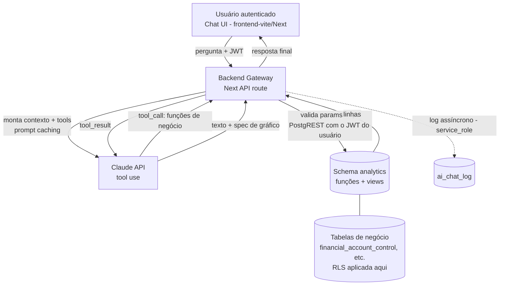

# Arquitetura — Chat de IA para Análise de Pagamentos

**Projeto:** Pagamentos · **Documento:** desenho de arquitetura
**Criado:** 2026-07-27 · **Revisado:** 2026-07-29 (Fase 1) · **Status:** Fases 0 e 1 concluídas — schema `analytics` APLICADO

> Este documento define a arquitetura de um chat de IA **embarcado no app** para análise
> conversacional dos dados de contas a pagar armazenados no Supabase (PostgreSQL).
>
> **Fase 0 (2026-07-28):** o schema real foi inspecionado via Supabase MCP e as suposições do
> desenho original foram confrontadas com ele. As views e os contratos de tools abaixo **refletem o
> schema real**. Achados no §13.
>
> **Fase 1 (2026-07-29): CONCLUÍDA** — `supabase/migrations/098_create_analytics_schema.sql`, via
> Supabase MCP. O schema `analytics` existe no banco com as 2 views, as 6 funções, a `ai_chat_log`
> e os GRANT/REVOKE; e **`analytics` está exposto no PostgREST** (Data API → Settings → Exposed
> schemas). Resultado da validação no §16. **A Fase 2 (gateway) está destravada.**
>
> ⚠️ **Durante a Fase 1, os advisors do Supabase revelaram duas RPCs pré-existentes que
> CONTORNAVAM a RLS e eram executáveis sem login** (`fn_delete_all_emails`, `search_text`) — uma
> delas apagava a base inteira. Fechadas pela **migration 099**; nada a ver com o chat, mas achadas
> por causa dele. Ver o `CLAUDE.md`, seção "Banco de dados".

---

## 1. Objetivo e escopo

Permitir que um usuário autenticado do app faça perguntas em linguagem natural sobre os
pagamentos ("quanto paguei por fornecedor em junho?", "qual o aging dos vencidos?", "top 10
fornecedores por valor no trimestre") e receba resposta em texto + tabela/gráfico, com a consulta
executada de forma **segura, auditável e read-only** sobre o Postgres do Supabase — e enxergando
**exatamente** o que aquele usuário já veria pela tela.

**Dentro do escopo:** consulta analítica read-only, agregações, séries temporais, rankings,
detalhamento (drill-down) sob demanda.

**Fora do escopo (v1):** qualquer escrita/alteração de dados, ações operacionais (dar baixa,
enviar cobrança), previsões/forecast estatístico, acesso a dados fora do domínio de pagamentos e
**SQL gerado livremente pelo modelo** (text-to-SQL — ver §11).

---

## 2. Princípios de design

1. **Security-first.** O caminho de leitura do chat nunca usa `service_role`. O acesso é feito
   **com o JWT do próprio usuário** (papel `authenticated` via PostgREST), sobre um schema
   `analytics` de views/funções curadas, de modo que a **RLS já existente decide o que ele vê**.
   Ver §4.5 — a "role dedicada read-only" do desenho original **não funciona neste banco**.
2. **Semantic layer antes de SQL livre.** O modelo usa **ferramentas parametrizadas**
   (tool calling) sobre funções de negócio. Text-to-SQL é fallback controlado para perguntas
   abertas, nunca a via primária — e **fica fora da v1** (§11).
3. **Rastreabilidade total.** Toda interação (pergunta → tool/SQL → resultado → resposta) é
   logada para auditoria e melhoria contínua — alinhado ao padrão de logging/rastreabilidade
   do projeto.
4. **Custo previsível.** Prompt caching do schema/dicionário; agregações pré-computadas em
   views (ou materialized views) para não reprocessar em toda pergunta.
5. **Chave natural vs. técnica preservada.** A camada semântica expõe dimensões pela chave de
   negócio legível (fornecedor, empresa, status), resolvendo `sk_` internamente.

---

## 3. Visão geral do fluxo



Regra de ouro: **o browser nunca fala com a Claude API nem com o banco diretamente.** Todo o
tráfego passa pelo gateway server-side, único detentor da `ANTHROPIC_API_KEY`. O gateway
repassa o **JWT do usuário** ao PostgREST — ele não tem, e não precisa de, credencial de banco
com privilégio próprio para ler dado de negócio.

---

## 4. Componentes

### 4.1 Frontend — Chat UI
- Componente de chat no `frontend-vite` (React 18) ou nos apps Next, reaproveitando o design
  system existente (Atomic Design + Tailwind, tokens `status`/`loginGreen`).
- Renderiza: mensagens, tabela de resultado, gráfico (Recharts/similar a partir de uma
  `chart_spec` devolvida pelo backend) e o **SQL/ferramenta usada** (transparência opcional).
- Envia apenas: texto da pergunta + histórico curto da conversa. Autenticação via JWT do
  Supabase Auth já existente.

### 4.2 Backend Gateway (orquestrador)
- **Onde:** rota na Next API (`apps/api-backend`) — **decidido**. Já centraliza o envelope
  `{ success, data, error }` (`lib/response.ts`), o middleware de auth (`middleware.ts` +
  `lib/auth.ts`) e o acesso a segredos; e é lá que já vive o cliente anon que repassa o JWT
  (`getAnonClient`). Edge Function foi descartada por duplicar essa infraestrutura.
- **Responsabilidades:**
  1. Validar JWT e identificar o usuário (`getAuthenticatedUser`, já existente).
  2. Montar o system prompt + dicionário de dados + definição das tools (com prompt caching).
  3. Rodar o **loop de tool use** com a Claude API.
  4. **Validar os parâmetros** de cada tool call (Zod) e chamar a função em `analytics` via
     `rpc`, repassando o JWT do usuário.
  5. Formatar a resposta (`{ answer, table, chart_spec, tool_calls }`).
  6. Logar a interação — ver §17.3: **"assíncrono" no sentido de fire-and-forget NÃO funciona em
     serverless** e perderia a trilha de auditoria.
- **Dependência a criar:** o `@anthropic-ai/sdk` **não existe hoje** em nenhum app/pacote do
  monorepo (só há uso da Claude API em Python, no pipeline de extração). O gateway é greenfield.

> ⚠️ **Antes de escrever a primeira linha do gateway, ler o §17** — três itens deste desenho não
> funcionam em produção como descritos (duração da function, teto do loop, log assíncrono), e há
> armadilhas do modelo que quebram na primeira execução.

### 4.3 Camada de IA (Claude API)
- Modelo Claude via Anthropic API (a mesma conta já em uso no projeto).
- **Tool use** como mecanismo central. O modelo escolhe entre as funções de negócio do §6. Na v1
  **não há** `generate_sql`: pergunta que nenhuma tool atende recebe uma resposta honesta de
  "não sei responder isso" e vira insumo para uma tool nova (§11).
- **Prompt caching** (`cache_control`) no bloco de schema + dicionário + few-shot — reduz
  drasticamente o custo por pergunta.

### 4.4 Camada semântica (`analytics`)
- Um schema **`analytics`** dedicado, contendo **apenas funções/views de leitura** curadas,
  **exposto ao PostgREST** (Supabase → Settings → API → Exposed schemas) e consumido com
  `supabase.schema('analytics')`.
- **Cada tool é uma FUNÇÃO SQL, não uma view consultada por filtro.** Motivo concreto: o
  PostgREST só faz agregação (`sum()`, `count()`) com `db-aggregates-enabled`, **desligado por
  padrão no Supabase**. Como função:
  - a agregação roda no banco, independente dessa flag;
  - os parâmetros viajam como **bind** — o gateway nunca interpola string do modelo em SQL;
  - declarada `SECURITY INVOKER` (o padrão), a RLS das tabelas base continua valendo dentro dela.
- As **views planas** (fact + dimensões resolvidas) permanecem como base das funções e para o
  drill-down paginado.

### 4.5 Acesso a dados (JWT do usuário + RLS) — corrigido na Fase 0

> **O desenho original previa uma role `ai_readonly` e ela NÃO funciona neste banco.** As policies
> de `financial_account_control` são `TO authenticated` e usam `auth.uid()` (via
> `auth_group_sees_only_own()`). Uma role nova (a) não é `authenticated`, então a policy sequer é
> avaliada e tudo cai no *default-deny* — o chat leria **0 linhas**; e (b) mesmo com
> `GRANT authenticated TO ai_readonly`, `auth.uid()` seria `NULL` sem `SET LOCAL
> request.jwt.claims`, ou seja, reimplementar à mão o que o PostgREST já faz.

- O gateway consulta **com o token do próprio usuário**, exatamente como `canSeeConta` já faz em
  `apps/api-backend/lib/auth.ts` — chave **anon**, nunca `service_role`:

  ```ts
  await getAnonClient()
    .schema('analytics')
    .rpc('gasto_por_fornecedor', params)
    .setHeader('Authorization', `Bearer ${token}`);   // ← RLS do usuário se aplica
  ```

- **A RLS decide sozinha o recorte**, sem nada a duplicar em TS: hoje o grupo **Comercial**
  (`user_group.sees_only_own_accounts = true`) só enxerga as contas em que é dono (migration 076);
  os demais grupos veem tudo. Quando o RBAC por empresa/centro/plano entrar
  (`docs/design/permissoes-por-grupo.md`), o chat herda a mudança de graça.
- Views e funções declaradas `security_invoker` / `SECURITY INVOKER`, para que a RLS das tabelas
  base seja avaliada com o contexto do usuário.
- Sem role nova, sem driver `pg`, sem connection pooler, sem credencial de banco no gateway.

### 4.6 Observabilidade / auditoria
- Tabela `ai_chat_log` registrando: usuário, timestamp, pergunta, tools executadas, nº de linhas,
  latência, tokens/custo, erro (se houver). Base para auditoria, tuning de few-shot, detecção de
  abuso e — principalmente na v1 — para descobrir **quais tools faltam**.
- **O INSERT do log é a única escrita, e usa `service_role`.** É uma exceção deliberada e estreita
  ao princípio 1: ele veda o **acesso a dado de negócio**, e deixar o usuário auditado escrever a
  própria trilha de auditoria seria pior. A leitura do log é RLS-restrita ao próprio `user_id`.

---

## 5. Fluxo detalhado de uma pergunta

1. Usuário envia "aging dos vencidos por empresa".
2. Gateway valida JWT, monta o request com system prompt + dicionário + tools (blocos cacheados).
3. Claude responde com um `tool_call` → `aging_vencidos(group_by='empresa')`.
4. Gateway valida os parâmetros contra o schema Zod da tool e chama a função em `analytics` via
   `rpc`, repassando o JWT do usuário (LIMIT aplicado no corpo da função).
5. Gateway devolve o `tool_result` (linhas) ao modelo.
6. Claude gera a resposta em texto + uma `chart_spec` (tipo de gráfico, eixos, séries).
7. Gateway formata `{ answer, table, chart_spec, tool_calls }`, loga a interação e responde ao
   frontend, que renderiza texto + gráfico.

Se a RLS do usuário não permitir nenhuma das linhas, o passo 4 devolve conjunto vazio — o mesmo
caminho, sem tratamento especial: **o chat não tem visão privilegiada de nada**.

Pergunta aberta que não casa com nenhuma função: na v1 o modelo responde que não consegue e
sugere as tools disponíveis; a pergunta fica no `ai_chat_log` como candidata a virar tool nova.

---

## 6. Contrato das ferramentas (tool calling)

São **6 tools na v1**, todas parametrizadas — sem `generate_sql` (§11). Definições enviadas ao
modelo (JSON Schema resumido):

```jsonc
[
  {
    "name": "resumo_situacao",
    "description": "KPIs por situação (e opcionalmente por empresa): quantidade e valor em aberto, vencido, a vencer e pago. Use para 'como estamos', 'quanto tenho a pagar'.",
    "input_schema": {
      "type": "object",
      "properties": {
        "sk_company": { "type": "integer", "enum": [1, 2, 3] },
        "as_of":      { "type": "string", "format": "date" }
      }
    }
  },
  {
    "name": "gasto_por_periodo",
    "description": "Total agregado por período. Use para 'quanto paguei/devo em X'.",
    "input_schema": {
      "type": "object",
      "properties": {
        "date_from":   { "type": "string", "format": "date" },
        "date_to":     { "type": "string", "format": "date" },
        // vencimento -> due_date | pagamento -> payment_date | emissao -> issue_date
        "date_field":  { "type": "string", "enum": ["vencimento", "pagamento", "emissao"], "default": "vencimento" },
        "granularity": { "type": "string", "enum": ["dia", "semana", "mes", "trimestre"], "default": "mes" },
        // nomes da dimensão `status`, não texto livre
        "status":      { "type": "array", "items": { "type": "string",
                          "enum": ["pendente","vencido","a vencer","prorrogado","baixado",
                                   "protestado","cartório","pago","cancelado","falha"] } },
        "sk_company":  { "type": "integer", "enum": [1, 2, 3] }
      },
      "required": ["date_from", "date_to"]
    }
  },
  {
    "name": "gasto_por_fornecedor",
    "description": "Ranking/total por fornecedor. Use para 'top fornecedores', 'quanto para o fornecedor X'.",
    "input_schema": {
      "type": "object",
      "properties": {
        "date_from":  { "type": "string", "format": "date" },
        "date_to":    { "type": "string", "format": "date" },
        "date_field": { "type": "string", "enum": ["vencimento", "pagamento", "emissao"], "default": "vencimento" },
        // casado por trigrama sobre normalize_search(trade_name/legal_name), ou CNPJ exato
        "supplier":   { "type": "string" },
        "sk_company": { "type": "integer", "enum": [1, 2, 3] },
        "limit":      { "type": "integer", "maximum": 100, "default": 20 }
      },
      "required": ["date_from", "date_to"]
    }
  },
  {
    "name": "gasto_por_classificacao",
    "description": "Agrega por classificação contábil (centro de custo, plano de contas, grupo ou subgrupo). Use para 'gasto por centro de custo', 'quanto em despesa fixa'.",
    "input_schema": {
      "type": "object",
      "properties": {
        "date_from":   { "type": "string", "format": "date" },
        "date_to":     { "type": "string", "format": "date" },
        "date_field":  { "type": "string", "enum": ["vencimento", "pagamento", "emissao"], "default": "vencimento" },
        "group_by":    { "type": "string", "enum": ["centro_custo", "plano_contas", "grupo", "subgrupo"] },
        // natureza do grupo: 2 = Despesas, 8 = Custo (espelha /dashboard_despesas)
        "nature_ids":  { "type": "array", "items": { "type": "integer" } },
        "sk_company":  { "type": "integer", "enum": [1, 2, 3] },
        "limit":       { "type": "integer", "maximum": 100, "default": 20 }
      },
      "required": ["date_from", "date_to", "group_by"]
    }
  },
  {
    "name": "aging_vencidos",
    "description": "Aging dos títulos EM ABERTO já vencidos, por faixa (1-30, 31-60, 61-90, 90+).",
    "input_schema": {
      "type": "object",
      "properties": {
        "as_of":    { "type": "string", "format": "date" },
        "group_by": { "type": "string", "enum": ["empresa", "fornecedor", "centro_custo", "plano_contas", "faixa"], "default": "faixa" }
      }
    }
  },
  {
    "name": "listar_contas",
    "description": "Drill-down: lista as contas individuais de um recorte, paginado. Use depois de um agregado, quando o usuário pedir o detalhe.",
    "input_schema": {
      "type": "object",
      "properties": {
        "date_from":   { "type": "string", "format": "date" },
        "date_to":     { "type": "string", "format": "date" },
        "date_field":  { "type": "string", "enum": ["vencimento", "pagamento", "emissao"], "default": "vencimento" },
        "supplier":    { "type": "string" },
        "status":      { "type": "array", "items": { "type": "string" } },
        "sk_company":  { "type": "integer", "enum": [1, 2, 3] },
        "page":        { "type": "integer", "default": 1 },
        "limit":       { "type": "integer", "maximum": 100, "default": 50 }
      },
      "required": ["date_from", "date_to"]
    }
  }
]
```

Cada tool é uma **função SQL em `analytics`** (§4.4) — os parâmetros entram como **bind**, o
gateway nunca interpola string do modelo em SQL.

**Convenções que valem para todas (e precisam estar no dicionário do §9):**

- **`cancelado` (id 9) é excluído por padrão** de qualquer total, salvo quando o usuário pedir
  explicitamente — mesma convenção do `/consulta`, onde ele aparece no grid mas fica fora dos KPIs.
- **"Em aberto" é o conjunto explícito `status_id IN (1,2,3)`** (pendente, vencido, a vencer). As
  flags `has_opened`/`has_closed` da dimensão `status` **não** servem: estão todas `false` (§13).
- **`sk_company` é a empresa PAGADORA e independe do fornecedor** — pode existir conta da LEBIANCO
  cujo fornecedor é a OTIMOTEX. Nunca inferir uma da outra.
- **Casamento de nome de fornecedor usa `public.normalize_search(...)` + `pg_trgm`** (ADR-001,
  §15). Escrever `unaccent(lower(...))` inline devolve o mesmo resultado mas **não usa os índices**
  `idx_supplier_trade_name_trgm` / `idx_supplier_legal_name_trgm`, que são funcionais sobre
  `normalize_search`. É a mesma função usada pelo pipeline e pela RPC `resolve_supplier_id`.
- **Id 0 nas dimensões de classificação = "não informado"** (o sentinela existe com descrição
  `NULL` nos quatro cadastros) — 67 das 574 contas estão nessa condição.

---

## 7. Modelo de dados de apoio (validado na Fase 0 — aplicar só na Fase 1)

> Os nomes abaixo são os **reais**, conferidos no banco. As duas views foram executadas como
> consulta ad-hoc contra o Supabase (joins conferem, amostra correta) — mas **nenhum objeto foi
> criado**. O que o desenho original supunha e não existia está no §13.

```sql
CREATE SCHEMA IF NOT EXISTS analytics;

-- FACT PLANO de contas a pagar, dimensões resolvidas por chave natural legível.
-- Sentinela id 0 dos cadastros de classificação -> 'não informado'.
CREATE OR REPLACE VIEW analytics.vw_payables
WITH (security_invoker = true) AS
SELECT
    f.id                                                    AS payable_id,
    f.sk_company,
    c.trade_name                                            AS company_name,
    f.sk_supplier,
    COALESCE(NULLIF(btrim(s.trade_name), ''), s.legal_name) AS supplier_name,
    s.cnpj                                                  AS supplier_cnpj,
    f.status_id,
    st.status_name,
    (f.status_id IN (1, 2, 3))                              AS is_open,       -- pendente/vencido/a vencer
    (f.status_id = 9)                                       AS is_cancelled,  -- fora dos totais por padrão
    f.issue_date, f.due_date, f.payment_date,
    f.amount, f.amount_charged,
    f.document_type, f.payment_method, f.invoice_number,
    f.cost_center_id,
    COALESCE(cc.cost_center_description, 'não informado')    AS cost_center_name,
    f.chart_account_id,
    COALESCE(ca.account_description, 'não informado')        AS chart_account_name,
    COALESCE(g.group_description, 'não informado')           AS chart_group_name,
    g.type_group_id                                          AS chart_group_nature_id,   -- 2=Despesas, 8=Custo
    COALESCE(sg.subgroup_description, 'não informado')       AS chart_subgroup_name,
    sg.type_group_id                                         AS chart_subgroup_type_id   -- 5=Fixa, 6=Variável, 7=Custo merc.
FROM public.financial_account_control f
JOIN public.company  c  ON c.sk_company  = f.sk_company
JOIN public.supplier s  ON s.sk_supplier = f.sk_supplier
JOIN public.status   st ON st.status_id  = f.status_id
LEFT JOIN public.financial_cost_center cc ON cc.cost_center_id = f.cost_center_id
LEFT JOIN public.financial_chart_of_account ca ON ca.chart_account_id = f.chart_account_id
LEFT JOIN public.financial_chart_of_account_group    g  ON g.chart_account_group_id     = ca.chart_account_group_id
LEFT JOIN public.financial_chart_of_account_subgroup sg ON sg.chart_account_subgroup_id = ca.chart_account_subgroup_id;

-- AGING — por VENCIMENTO sobre o que está EM ABERTO.
-- NÃO filtrar por status_name = 'vencido': a trigger fn_set_status_from_due_date só reclassifica
-- em INSERT/UPDATE e o batch baixa-automatica roda 1x/dia, então o rótulo fica defasado
-- (hoje 1 conta rotulada 'vencido' contra 105 em aberto).
CREATE OR REPLACE VIEW analytics.vw_aging_vencidos
WITH (security_invoker = true) AS
SELECT company_name, supplier_name, cost_center_name,
       CASE WHEN CURRENT_DATE - due_date BETWEEN  1 AND 30 THEN '1-30'
            WHEN CURRENT_DATE - due_date BETWEEN 31 AND 60 THEN '31-60'
            WHEN CURRENT_DATE - due_date BETWEEN 61 AND 90 THEN '61-90'
            ELSE '90+' END              AS faixa,
       SUM(amount)::numeric(15,2)       AS total_vencido,
       COUNT(*)                         AS qtd
FROM analytics.vw_payables
WHERE is_open AND due_date < CURRENT_DATE
GROUP BY 1, 2, 3, 4;

-- Tabela de auditoria do chat
CREATE TABLE IF NOT EXISTS analytics.ai_chat_log (
    id            bigint GENERATED ALWAYS AS IDENTITY PRIMARY KEY,
    created_at    timestamptz NOT NULL DEFAULT now(),
    user_id       uuid NOT NULL REFERENCES auth.users(id),
    question      text NOT NULL,
    tool_calls    jsonb,        -- ferramentas executadas + parâmetros
    row_count     integer,
    latency_ms    integer,
    input_tokens  integer,
    output_tokens integer,
    error         text
);

ALTER TABLE analytics.ai_chat_log ENABLE ROW LEVEL SECURITY;

CREATE POLICY ai_chat_log_select_own ON analytics.ai_chat_log
  FOR SELECT TO authenticated USING (user_id = auth.uid());

-- Exposição + grants. O REVOKE é obrigatório: o Supabase concede escrita por DEFAULT em todo
-- objeto novo do schema (padrão recorrente das migrations 056/057/079/081 deste projeto).
GRANT USAGE ON SCHEMA analytics TO authenticated;
GRANT SELECT ON analytics.vw_payables, analytics.vw_aging_vencidos TO authenticated;
GRANT SELECT ON analytics.ai_chat_log TO authenticated;              -- a policy acima restringe
REVOKE INSERT, UPDATE, DELETE, TRUNCATE ON ALL TABLES IN SCHEMA analytics FROM authenticated, anon;
REVOKE ALL ON SCHEMA analytics FROM anon;
-- GRANT EXECUTE nas funções do §6 -> authenticated; REVOKE das mesmas para anon.
```

**Notas de modelagem apuradas na Fase 0:**

- `JOIN` (não `LEFT`) em `company`/`supplier`/`status`: as três FKs são `NOT NULL` e há **0
  órfãos** — `LEFT` só mascararia inconsistência futura.
- Grupo do plano de contas vem da **FK direta** `ca.chart_account_group_id`, não do subgrupo:
  verificado que as duas **nunca divergem** (0 de 572 planos) e é a direta que o frontend usa.
- Faixas de aging começam em **1-30**, não 0-30: o que vence **hoje** ainda não está vencido.
- **Sem materialized view.** São 574 linhas na tabela fato, com 19 índices — view simples resolve.
  Reavaliar só se o volume mudar de ordem de grandeza.

---

## 8. Guardrails de segurança

- **Sem `service_role` na leitura.** O caminho de dado de negócio usa o **JWT do usuário** (chave
  anon). A única escrita é o INSERT em `ai_chat_log`, com `service_role` — exceção estreita e
  justificada em §4.6.
- **Superfície mínima: sem SQL arbitrário na v1.** Só as 6 funções parametrizadas do §6, com
  parâmetros validados por Zod no gateway e passados como bind. Sem `generate_sql`, não há
  validador de AST nem allowlist de objetos a manter — o vetor simplesmente não existe.
- **RLS preservada** por `security_invoker`/`SECURITY INVOKER` — o usuário só enxerga o que já
  poderia ver pela tela. Nada é reimplementado em TypeScript.
- **`REVOKE` explícito no schema `analytics`** (§7). O Supabase concede escrita por **default** em
  todo objeto novo; o `REVOKE` é o que impede o schema analítico de nascer gravável.
- **Limite de linhas** no corpo de cada função (`LIMIT`), para uma resposta não estourar o contexto
  do modelo nem a memória do gateway.
- **Segredos server-side:** `ANTHROPIC_API_KEY` nunca chega ao browser. O gateway não guarda
  credencial de banco — usa a anon key + o token do usuário.
- **Rate limiting** por usuário e limite de custo/tokens por sessão.
- **Sanitização de saída:** o gateway nunca ecoa credenciais/segredos; erro 5xx não vaza detalhe
  interno — reusar `failFromError` de `apps/api-backend/lib/response.ts`, que já faz exatamente
  isso (4xx curado ecoa; 5xx vira mensagem genérica + `console.error`).

**Terreno já limpo para o dia em que o `generate_sql` voltar (§11).** A Fase 0 encontrou `TRUNCATE`
concedido a `anon` **e** `authenticated` em quase todo o `public` — e **`TRUNCATE` não é filtrado
por RLS**, ou seja, nenhuma policy protegeria contra ele. Era inalcançável (o PostgREST não o expõe
e nenhum dos dois papéis pode abrir conexão), mas implementar text-to-SQL com conexão direta sob
esses papéis criaria exatamente esse caminho. **Resolvido pela migration 097** (2026-07-28), que
revogou `TRUNCATE` dos dois papéis, tirou toda a escrita de `anon` e corrigiu o
`ALTER DEFAULT PRIVILEGES` para que tabela nova não reintroduza o resíduo.

---

## 9. Precisão

- **Dicionário de dados** como contexto do modelo. Conteúdo mínimo, apurado na Fase 0:
  - as **11 situações** da dimensão `status` e o fato de que "em aberto" é `{1,2,3}`;
  - `cancelado` fora dos totais por padrão;
  - as três empresas (1 OTIMOTEX TECIDOS · 2 LEBIANCO · 3 OTIMOTEX FARDOS) e que **`sk_company`
    é independente do fornecedor**;
  - id 0 = "não informado" nas dimensões de classificação;
  - os 32 valores de `document_type` e 16 de `payment_method` (extraídos dos CHECK reais);
  - as três datas: `payment_date` = pagamento, `due_date` = vencimento, `issue_date` = emissão;
  - regras de negócio já documentadas no `CLAUDE.md` que explicam números "estranhos" (vencimento
    autoritativo pelo fator do código de barras; empresa pagadora por precedência).
- **Few-shot** com 5–10 pares pergunta→tool reais, evoluídos a partir do `ai_chat_log`.
- **Funções determinísticas** em vez de SQL gerado: é o que garante que o mesmo número apareça no
  chat e no `/consulta`.
- **Devolver a tool + parâmetros ao usuário** (transparência) permite validação humana rápida.
- **Testes de regressão de perguntas:** conjunto fixo de perguntas com resultado esperado, rodado
  a cada mudança de prompt/schema (alinhado ao "todo componente tem teste").

  > **A asserção NÃO pode ser um número absoluto (achado da Fase 1 — não regredir).** O pipeline
  > roda a cada 5 min e o batch de vencidos 1×/dia, então as âncoras **derivam em 24 h**. Medido:
  > entre 28/07 e 29/07 as contas foram de **574 → 578**, as pagas de 442 → 443, as em aberto de
  > 105 → 108 e as **vencidas de fato de 1 → 6**. Um teste com literal reprovaria no dia seguinte,
  > sem nenhum defeito real — e o ruído treinaria a equipe a ignorar a bateria.
  >
  > As duas formas corretas: (a) **oráculo diferencial** — a tool e uma query SQL de controle
  > equivalente têm de devolver o mesmo valor, seja ele qual for (foi assim que a Fase 1 validou as
  > funções, §16); (b) **janela histórica fechada** (`due_date < '2026-07-01'`), imune a dado novo.

---

## 10. Custo e performance

- **Prompt caching** do bloco schema+dicionário+tools (estático) → só a pergunta varia; leitura
  de cache custa ~10% do input.
- **Sem materialized view por ora.** A tabela fato tem **574 linhas** e 19 índices — view simples
  responde de sobra, e uma MV traria custo de refresh e risco de dado velho sem ganho. Reavaliar
  se o volume mudar de ordem de grandeza (aí, refresh agendado pelo Task Scheduler já operado).
- **Limite de linhas** por resposta (paginação/drill-down sob demanda) evita estourar contexto.
- **Modelo por complexidade:** um modelo mais econômico para roteamento/pergunta simples e um
  mais capaz para análise complexa, se quiser otimizar custo (opcional).

---

## 11. Roadmap de implementação (faseado)

0. **Fase 0 — Validação de schema. ✅ CONCLUÍDA (2026-07-28).** Banco inspecionado via Supabase
   MCP, divergências levantadas (§13), views e contratos de tools corrigidos. **Nada aplicado.**
1. **Fase 1 — Camada semântica. ✅ CONCLUÍDA (2026-07-29).** Migration `098` aplicada: schema
   `analytics`, as 2 views do §7, as **6 funções** do §6, a `ai_chat_log` com RLS e os
   `GRANT`/`REVOKE`. **Sem `ai_readonly`** — a role foi descartada (§4.5). Validação no §16.
   `analytics` exposto no PostgREST e conferido por HTTP com a anon key real.
2. **Fase 2 — Gateway + tool use.** Rota na Next API com o loop de tool use, prompt caching,
   validação de parâmetros (Zod), chamada por `rpc` com o JWT do usuário, logging.
3. **Fase 3 — Frontend.** Componente de chat + render de tabela/gráfico no design system.
4. **Fase 4 — Hardening.** Rate limit, testes de regressão de perguntas (§9), tuning de few-shot.
5. **Fase 5 — Text-to-SQL (só depois da v1, se necessário).** Reavaliar com base no
   `ai_chat_log`: as perguntas que nenhuma tool atendeu tendem a virar **tools novas**, que são
   determinísticas e mais baratas de manter. Se ainda assim o fallback se justificar, ele exige
   conexão direta + validador de AST + allowlist + txn read-only (o `REVOKE` do `TRUNCATE`, que
   era pré-requisito, já foi feito pela migration 097 — §8).

> A troca de ordem em relação ao desenho original é deliberada: text-to-SQL saiu de "Fase 3" para
> o fim. É o maior vetor de risco e o mais caro de proteger, e a hipótese a testar primeiro é que
> 6 tools bem escolhidas cobrem a maior parte das perguntas reais.

---

## 12. Riscos e mitigações

| Risco | Mitigação |
|---|---|
| SQL malicioso via text-to-SQL | **Eliminado na v1** — não há SQL arbitrário (§8). Se voltar (Fase 5): AST + allowlist + txn read-only + `REVOKE` do `TRUNCATE` antes |
| Vazamento de dados entre usuários | RLS já existente + JWT do usuário + `security_invoker`. O chat não tem visão privilegiada (§4.5) |
| Resposta numérica incorreta (alucinação) | Funções determinísticas + transparência da tool + testes de regressão com âncoras medidas (§9) |
| **Número do chat ≠ número da tela** | Mesmas convenções do app codificadas nas funções: `cancelado` fora dos totais, "em aberto" = `{1,2,3}`, aging por vencimento e não pelo rótulo (§6) |
| Custo de tokens crescente | Prompt caching + limites por sessão + agregação no banco |
| Exposição de segredos | Tudo server-side; nenhuma key no browser; gateway sem credencial de banco |
| Deriva schema ↔ dicionário | Dicionário versionado junto do schema; teste que compara colunas |
| **Schema `analytics` nascer gravável** | `REVOKE` explícito na criação (§7) — o default do Supabase concede escrita |

---

## 13. Resultado da Fase 0 — o que foi validado e o que mudou

Inspeção do Supabase (projeto `Financeiro`, PostgreSQL 17.6) em 2026-07-28, só com
`SELECT`/introspecção. **Nada aplicado no banco.**

### 13.1 Divergências que invalidavam o desenho original

| # | O desenho supunha | Realidade | Onde foi corrigido |
|---|---|---|---|
| D1 | Role `ai_readonly` + `security_invoker` herdam a RLS | Policies são `TO authenticated` e usam `auth.uid()`; role nova não casa policy alguma → *default-deny*, **0 linhas** | §4.5 |
| D2 | Aging filtra `status_name = 'vencido'` | Só **1** das 574 contas tem esse rótulo; vencido de fato é `due_date < CURRENT_DATE AND status_id IN (1,2,3)` — o rótulo depende de trigger em INSERT/UPDATE e do batch diário | §7 |
| D3 | `dim_company`, `dim_supplier`, `dim_status` | `company`, `supplier`, `status` | §7 |
| D4 | `f.supplier_id` / `s.supplier_name` | FK é **`f.sk_supplier`**; nome é `supplier.trade_name` (0 vazios) com `legal_name` de fallback (26 vazios). `supplier.supplier_id` existe, mas é chave de **negócio** | §7 |
| D5 | `c.company_name` | `company.trade_name` / `legal_name` | §7 |
| D6 | "status é enum ou dimensão?" | É **dimensão** — mas `has_opened`/`has_closed`/`has_invoiced` estão **todos `false`**, então "em aberto" só pelo set `{1,2,3}` | §6, §7 |
| D7 | Fact sem classificação contábil | Existem centro de custo, plano, grupo (natureza) e subgrupo (tipo) — a dimensão mais usada nos dashboards; sentinela id 0 com descrição `NULL` | §7 |
| D8 | Materialized view a definir | 574 linhas + 19 índices → view simples | §7, §10 |

### 13.2 Respostas às perguntas que estavam em aberto

- **Dimensões:** confirmadas acima. Empresas: 1 OTIMOTEX TECIDOS · 2 LEBIANCO · 3 OTIMOTEX FARDOS.
- **Status:** é dimensão (`status`), ids 1–10 para contas a pagar — o id **30 ("ativo") é de contas
  bancárias** e não deve aparecer no domínio do chat.
- **Datas:** `issue_date` (5 nulos), `due_date` (0 nulos), **`payment_date`** — esta é a **data de
  pagamento** e responde caixa realizado direto (decisão do dono do produto). A auditoria estrutural
  da coluna está no `CLAUDE.md`, bloco da migration 096.
- **Volume:** 574 contas · 1.289 fornecedores. Pequeno; sem MV.
- **Multi-tenant:** sim, mas **por grupo de usuário, não por empresa**. Só o grupo **Comercial**
  (`sees_only_own_accounts = true`, 4 usuários) é restrito, e a RLS já resolve — nada a implementar.
- **Gateway:** **Next API** (§4.2). Edge Function descartada.

### 13.3 Decisões tomadas na Fase 0

1. Acesso a dados por **PostgREST + JWT do usuário**, não por role dedicada (§4.5).
2. Tools como **funções SQL** (`SECURITY INVOKER`), não views filtradas — o PostgREST não agrega
   sem `db-aggregates-enabled` (§4.4).
3. **`generate_sql` fora da v1** (§11).
4. Schema **`analytics` exposto no PostgREST**, com `REVOKE` explícito (§7).

### 13.4 Confirmado — nada a mudar

- O **ADR-001** (§15) está coberto pela infraestrutura existente: `pg_trgm` 1.6 e `unaccent` 1.1
  instalados, `pgvector` **ausente**, e o normalizador `public.normalize_search(txt)` já tem
  **índices GIN trigram funcionais** em `supplier.trade_name` e `legal_name`. As funções devem
  chamar `normalize_search` — `unaccent(lower(...))` inline dá o mesmo resultado mas **não usa o
  índice**, porque o planner só casa expressão idêntica.
- **O gateway é greenfield:** não há `@anthropic-ai/sdk` em nenhum app ou pacote do monorepo.

---

## 14. Pré-requisitos

**Já disponível (verificado na Fase 0):** Postgres estruturado no Supabase; Supabase Auth (JWT);
Claude API ativa (conta em uso pelo pipeline Python); Next API com envelope padronizado, middleware
de auth e o cliente anon que repassa o JWT (`getAnonClient` / `canSeeConta` em `lib/auth.ts`); RLS
por grupo já implantada (migrations 076/078/080/081); `pg_trgm` + `unaccent` + `normalize_search`
com índices trigram funcionais; design system para a UI.

**A criar:** schema `analytics` (views do §7 + as 6 funções do §6), `ai_chat_log` com RLS e
`GRANT`/`REVOKE`, a exposição de `analytics` no PostgREST, a dependência `@anthropic-ai/sdk` no
`apps/api-backend`, o gateway de tool use e o componente de chat no frontend.

**Deixou de ser necessário:** a role `ai_readonly` (§4.5) e o validador de text-to-SQL (§11).

---

## 15. Decisões registradas (ADR)

### ADR-001 — Não usar vetores/RAG no núcleo analítico

**Status:** aceito · 2026-07-27

**Contexto.** O núcleo do chat responde perguntas analíticas sobre dados **estruturados** de
contas a pagar (somas, aging, rankings, séries temporais por fornecedor/empresa/período/status).
Esse é um problema de cálculo **determinístico** sobre linhas de tabela, onde um número
aproximado é inaceitável (financeiro). RAG/embeddings resolvem "recuperar trechos de texto por
similaridade semântica" em conteúdo não estruturado — natureza oposta à do núcleo.

**Decisão.**
1. O núcleo analítico usa **semantic layer (tool calling) + text-to-SQL determinístico** sobre o
   schema `analytics`. **Não** usar vetores/pgvector no caminho de cálculo.
2. Casamento aproximado de nomes (fornecedor, empresa) usa **`unaccent` + `pg_trgm`**
   (similaridade por trigrama) com índice funcional — padrão já adotado no projeto —, **não**
   embeddings.

**Consequências.** Respostas exatas, auditáveis e mais baratas; sem infraestrutura de vetores
para manter; sem risco de resposta numérica não-determinística. O modelo é obrigado a passar
pelas funções/SQL validado, nunca por recuperação semântica de valores.

**Reconsiderar (quando pgvector/RAG passam a fazer sentido) — fora do núcleo:**
- Busca semântica no **texto de documentos** (corpo de e-mail, texto extraído de boleto/NF-e):
  feature documental separada, não a análise de pagamentos.
- **Few-shot dinâmico** em escala: recuperar, via embeddings, os pares pergunta→SQL mais
  similares do `ai_chat_log` para injetar como exemplos. Otimização acessória, só com volume.

**Diretriz de implementação (Claude Code):** não introduzir pgvector/embeddings na Fase 1–4.
Qualquer uso de vetores é feature à parte, decidida explicitamente, e nunca no cálculo dos
números.

---

## 16. Resultado da Fase 1 — o que foi aplicado e validado

Migration `supabase/migrations/098_create_analytics_schema.sql`, aplicada via Supabase MCP em
2026-07-29. Idempotente.

### 16.1 Objetos criados

| Tipo | Objeto | Confirmado |
|---|---|---|
| Schema | `analytics` | `anon` **sem** `USAGE` |
| View | `vw_payables`, `vw_aging_vencidos` | `security_invoker = true` nas duas |
| Função | `resumo_situacao`, `gasto_por_periodo`, `gasto_por_fornecedor`, `gasto_por_classificacao`, `aging_vencidos`, `listar_contas` | 6/6 `SECURITY INVOKER` + `STABLE` |
| Tabela | `ai_chat_log` | RLS ligada, policy `ai_chat_log_select_own` |

### 16.2 Segurança

- **0 grants de escrita** para `anon`/`authenticated` em todo o schema (a receita corrigida da 097:
  conferir os **dois** papéis e incluir `TRUNCATE`).
- **6/6 funções bloqueadas para `anon`** — o `REVOKE ... FROM PUBLIC` é o que fecha isso, já que o
  PostgreSQL concede `EXECUTE` a `PUBLIC` por default em toda função criada.
- `authenticated`: **não** insere em `ai_chat_log` (a escrita é só do gateway via `service_role`) e
  **não** faz `UPDATE` nas views — que, sendo simples, poderiam ser auto-atualizáveis; foi
  exatamente essa a escalada de privilégio da view `app_user` fechada pela 081.
- `ALTER DEFAULT PRIVILEGES` no schema: objeto novo já nasce sem escrita e sem acesso do `anon`.
- **`SET search_path = ''` nas 6 funções**, fechando o `function_search_path_mutable` que os
  advisors do Supabase apontaram. Só é possível porque toda referência já estava qualificada
  (`analytics.vw_*`, `public.normalize_search`) — e é uma segunda razão para o `LIKE` ter vencido o
  operador `%` do `pg_trgm`: com o search_path vazio, `%` ficaria irresolvível e a função quebraria
  **em runtime**, não na criação. Reconferido depois do `SET`: os 6 resultados idênticos.

> **Achados PRÉ-EXISTENTES que os advisors levantaram e que NÃO foram tocados** (fora do escopo da
> Fase 1, cada um merece decisão própria): a view `public.app_user` aparece como legível por `anon`
> (`auth_users_exposed`, ERROR) — a 081 revogou a escrita, não a leitura; a tabela
> `public.supplier_tmp` tem RLS ligada e nenhuma policy (resíduo de migração?); e várias funções de
> **trigger** do `public` estão expostas como RPC executável por `anon`/`authenticated`, entre elas
> `fn_delete_all_emails()`. Nenhuma é regressão da 098.

### 16.3 A RLS propaga pelo `security_invoker` — validado com o papel real

Teste com `SET LOCAL role authenticated` + `request.jwt.claims`, que é o que o PostgREST monta:

| Usuário | Grupo | `vw_payables` | `listar_contas` |
|---|---|---|---|
| ester@otimotex.com.br | Comercial (`sees_only_own_accounts`) | **48** | 48 |
| barbara@otimotex.com.br | Financeiro (irrestrito) | **578** | 50 (limite) |

É o resultado que autoriza seguir para a Fase 2. Se os dois vissem o mesmo total, o
`security_invoker` não teria pegado e o chat furaria a visibilidade por dono da migration 076.

**Conferido também pelo HTTP real** (anon key do `.env`, depois de expor o schema): um `POST
/rest/v1/rpc/resumo_situacao` com `Accept-Profile: analytics` como **`anon`** devolve
`401 / 42501 permission denied for schema analytics`. É a resposta correta e prova as duas
metades de uma vez — o PostgREST **roteia** para o schema (não é mais `PGRST106 Invalid schema`)
**e** o papel anônimo não passa. O caminho autenticado foi provado na camada SQL (tabela acima);
ponta a ponta por HTTP, ele será exercitado naturalmente pelo gateway da Fase 2, que é o
consumidor real.

### 16.4 Os números batem com o app (oráculo diferencial)

Cada tool foi comparada com a query de controle equivalente sobre `financial_account_control`:

| Tool | Qtd | Valor | Bate |
|---|---|---|---|
| `resumo_situacao` (exclui cancelado) | 551 | R$ 8.338.039,49 | ✅ qtd + valor + `overdue_count` |
| `aging_vencidos` | 6 | R$ 23.478,49 | ✅ |
| `gasto_por_periodo` (jul/2026) | 346 | R$ 6.161.000,27 | ✅ |

Comportamentos de borda conferidos: busca de fornecedor por nome sem acento/caixa
(`normalize_search` + `LIKE`) casa "OTIMOTEX" e "CONFECCOES OTIMOTEX"; `date_field='pagamento'`
devolve o caixa realizado (313 contas em julho); `p_status` explícito **inclui** cancelado (24 em
julho) enquanto a ausência dele exclui; `p_group_by` inválido (testado com `'DROP TABLE'`) devolve
**conjunto vazio** em vez de agregar tudo numa linha `NULL`; e `p_limit = 9999` é clampado a 100.

### 16.6 O alicerce que a Fase 2 vai usar foi verificado

`canSeeConta` chama `.setHeader('Authorization', ...)` sobre o **singleton** `getAnonClient()`, e o
gateway vai reusar exatamente esse padrão. Se o `setHeader` mutasse o cliente compartilhado, duas
requisições concorrentes de usuários diferentes disputariam o mesmo objeto e uma leria com o JWT da
outra — vazamento cross-user, com a RLS aplicando o recorte do usuário errado.

**Medido, não deduzido:** o postgrest-js tem **duas** camadas independentes — `from()` já constrói
o builder com um `new Headers(...)` próprio, e `setHeader` faz copy-on-write. Sabotando só a
segunda, **não há vazamento** (a primeira sozinha isola); sabotando as duas, as duas requisições
saem com o mesmo `Authorization`. Ou seja: é seguro hoje e com folga.

Como isso é garantia da **implementação instalada** e não do contrato público — um `npm update`
poderia quebrá-la em silêncio, sem erro e sem teste vermelho —, o invariante virou teste:
`apps/api-backend/lib/auth.concurrency.test.ts` (arquivo separado de `auth.test.ts`, que mocka o
SDK inteiro e portanto não cobre isto). O teste foi validado contra o mutante das duas camadas: ele
falha quando o defeito existe.

### 16.5 Decisões de implementação tomadas na Fase 1

1. **`LIKE` sobre `normalize_search`, não o operador `%` do `pg_trgm`.** Os dois usam os índices GIN
   funcionais, mas o `%` depende de a extensão estar no `search_path` da sessão **e** do limiar
   `pg_trgm.similarity_threshold` — duas variáveis de ambiente a mais para um ganho nulo neste
   volume. O `LIKE` é operador do core e é o que `findSupplierIdsByTerm` já usa no app.
2. **`resumo_situacao` devolve o rótulo E o vencido recalculado** (colunas `overdue_*`). O rótulo
   `status_name` é o que a tela mostra, mas é defasado (6 rotuladas `vencido` contra 100+ em atraso
   real, pelo D2). Devolver só um dos dois faria o chat mentir por omissão em qualquer direção.
3. **Despacho de `date_field`/`granularity`/`group_by` por `CASE`, nunca SQL dinâmico** — mantém
   tudo como bind, e valor fora do domínio cai num `IN (...)` que devolve vazio em vez de agregar
   silenciosamente errado.
4. **Retorno enxuto em `listar_contas`** — sem `barcode`, `sender_email`, `subject`,
   `email_body_excerpt`, `processing_notes`. O chat é análise financeira, não auditoria de
   extração, e cada coluna a mais consome contexto do modelo em toda resposta.

---

## 17. Requisitos de robustez da Fase 2 (achados do code review de 2026-07-29)

O desenho do gateway (§4.2, §5, §8, §10) está correto no que **decidiu** — JWT do usuário, tools
parametrizadas, sem `service_role` — e silencioso em três pontos que decidem se ele **funciona em
produção**. Nenhum é difícil; todos são fáceis de esquecer, e dois deles o projeto já pagou para
aprender em outro contexto.

### 17.1 BLOQUEADOR — `maxDuration` ausente: o gateway vai dar timeout

Verificado: **não há `vercel.json` no `apps/api-backend` nem `maxDuration` declarado em lugar
nenhum**. O default de uma Node function na Vercel é de **10–15 s**. Um loop de tool use com 2–3
iterações — cada uma um round-trip ao modelo mais um `rpc` ao Postgres — passa disso na primeira
pergunta que combine agregado e drill-down.

São **duas** mudanças, e uma não substitui a outra:

- `export const maxDuration = 300` na rota (eleva o teto da function);
- **streaming** na chamada à Claude API (evita o timeout de *request*; é a recomendação padrão do
  guia da API para qualquer chamada longa). Streaming **não** estende o teto da function.

> É a terceira vez que este projeto encontra a mesma classe de problema: `CLAUDE_API_TIMEOUT` no
> `extract_pdf.py`, `AbortSignal.timeout` no `python-bridge.ts` (S3-1) e agora o gateway. O padrão
> do `CLAUDE.md` — "timeout explícito em toda I/O externa" — vale aqui na escrita, não depois do
> incidente.

### 17.2 BLOQUEADOR — o loop de tool use precisa de teto de iterações

O §5 descreve o ciclo (`tool_call` → executa → `tool_result` → repete) **sem limite**. Um modelo
que se convença de precisar de mais uma consulta itera até a function morrer, com custo
proporcional. Sem teto, o "limite de custo/tokens por sessão" prometido no §8 não existe de fato.

O Tool Runner do SDK expõe `max_iterations`; um loop manual precisa do contador explícito. Atingir
o teto é uma resposta honesta ("não consegui responder"), não uma exceção — e vira insumo do §11.

### 17.3 BLOQUEADOR — o log "assíncrono" do §4.2 não executaria

Em serverless a function é **congelada assim que a resposta é retornada**: um `void logInteraction()`
disparado depois do `return` simplesmente não roda. Perde-se a `ai_chat_log` — que é o pilar 3 do
desenho e a fonte para descobrir quais tools faltam (§11).

Duas saídas, sem terceira: `waitUntil` (Vercel) ou log **síncrono** antes de responder.

### 17.4 Custo — o prompt caching do §10 pode nunca acertar

Três coisas que o §10 assume e convém medir em vez de supor:

| Fato | Consequência |
|---|---|
| Mínimo cacheável no Opus 5 = **512 tokens** | Abaixo disso não cacheia, **sem erro** (`cache_creation_input_tokens: 0`) |
| TTL default = **5 min**; break-even = 2 requisições | Num chat interno com perguntas espaçadas, expira entre uma e outra: paga-se o prêmio de escrita (~1,25×) e nunca se lê |
| Qualquer byte alterado no prefixo invalida tudo depois | Ver o invalidador provável abaixo |

**O invalidador mais provável está no próprio §9.** Perguntas como "quanto paguei este mês" exigem
que o modelo saiba a data de hoje. Se a data for interpolada no bloco cacheado do dicionário, o
prefixo muda a cada requisição e **nada** cacheia. A data tem de ficar **depois** do último
breakpoint. Verificar com `usage.cache_read_input_tokens` desde a primeira versão: zero em
requisições repetidas = há invalidador.

### 17.5 Armadilhas do modelo que quebram na primeira execução

O documento não fixa modelo. O default do projeto é **`claude-opus-5`**, e nele:

| Armadilha | Efeito |
|---|---|
| `temperature` / `top_p` / `top_k` | **400** — foram removidos. Código copiado de exemplo antigo quebra de imediato |
| `thinking` ligado por default | `max_tokens` cobre **thinking + resposta**; dimensionar apertado trunca a resposta no meio |

### 17.6 Contrato do loop — dois detalhes que corrompem o diálogo

- **Tool que falha devolve `tool_result` com `is_error: true`** — nunca omitir o bloco. Omitir
  quebra o pareamento `tool_use`/`tool_result` e confunde o modelo na iteração seguinte.
- **Tool calls paralelos voltam em UMA única mensagem `user`.** O modelo pode pedir várias tools
  numa resposta só; dividir os resultados em mensagens separadas ensina o modelo a parar de
  paralelizar.

### 17.7 Estrutura — o gateway não é Repository → Service → Route

Os 8 CRUDs seguem esse padrão porque são **recursos**; o gateway é um **orquestrador com máquina de
estados**. Forçá-lo no molde de CRUD produz um "service" que é só um loop. Sugestão:

```
lib/ai-chat/
  tools.ts     # definições das 6 tools + validação dos parâmetros
  gateway.ts   # o loop de tool use (teto de iterações, streaming, erro de tool)
  log.ts       # ai_chat_log (service_role) — chamado antes de responder, ou via waitUntil
app/api/ai-chat/route.ts
```

Cada peça testável isoladamente — que é o que falta num loop monolítico.

**Zod 4 × `betaZodTool`:** o projeto está em Zod `4.4.3` e o helper do SDK foi escrito contra Zod 3;
pode não aceitar schemas v4. A saída natural é `betaTool()` com JSON Schema cru — que **casa melhor
aqui de qualquer forma**, já que o §6 deste documento já define os schemas em JSON Schema. Converter
para Zod só para o helper reconverter é trabalho circular. O Zod permanece onde importa: validando
os parâmetros no gateway antes do `rpc`.

### 17.9 Erros do SDK da Anthropic ✅ CORRIGIDO NA RAIZ (2026-07-29)

> **Resolvido antes da Fase 2 começar.** O que segue descreve o problema e a correção — a Fase 2
> herda o comportamento certo, mas o gateway **ainda deve traduzir** 429/401/400 para mensagens
> úteis (ver o fim desta seção): hoje eles viram 500 genérico, o que é seguro mas pouco informativo.
>
> **Correção aplicada:** `failFromError` deixou de reconhecer erro por **duck-typing** (`.status`) e
> passou a exigir a base explícita **`ApiServiceError`** (`apps/api-backend/lib/api-error.ts`). Erro
> que não estende essa classe — de terceiro ou bug nosso — vira **500 genérico + log**, nunca ecoa.
> As 12 classes de service migraram para a base; os 23 mocks de teste que **duplicavam** o contrato
> (`class XServiceError extends Error` dentro do `vi.mock`) passaram a reusá-lo via
> `vi.importActual('@/lib/api-error')`; e `failFromError` ganhou cobertura própria — antes tinha
> **zero testes para 62 call sites**. Suíte: 374 verdes, lint/typecheck/prune limpos.
>
> O problema original, para registro:

O §8 diz "reusar `failFromError`, que já faz exatamente isso". Faz — **para os erros que ele foi
desenhado para tratar**. Lendo o código ([lib/response.ts:36](../apps/api-backend/lib/response.ts#L36)),
a regra é: erro com `status` **< 500 ecoa a mensagem**; 5xx vira genérico + log.

Isso funciona porque os erros 4xx do CRUD são **mensagens curadas em pt-BR** que os services
lançam. Os erros do SDK da Anthropic **também carregam `status`** — e não são curados:

| Erro do SDK | `status` | O que `failFromError` faria hoje |
|---|---|---|
| `RateLimitError` | 429 | Ecoa a mensagem crua do provider ao usuário final |
| `AuthenticationError` | 401 | Ecoa — e o problema é a **nossa** chave, não a sessão dele |
| `BadRequestError` | 400 | Ecoa detalhe de payload/modelo |

O resultado é um usuário do financeiro vendo texto em inglês sobre limites de organização e nomes
de modelo — ruído para ele e informação de infraestrutura para quem estiver olhando. E o 401 é
ativamente enganoso: o usuário conclui que **sua sessão** expirou.

**O que a correção já garante:** nenhum desses três ecoa mais — todos viram 500 genérico + log,
porque não estendem `ApiServiceError`. O vazamento está fechado.

**O que ainda cabe ao gateway (qualidade, não segurança):** 500 genérico é seguro mas pouco
informativo para o usuário. Traduza os casos que ele pode agir a respeito, lançando um
`ApiServiceError` com mensagem em pt-BR — mesma ideia do `mapWriteError` dos anexos:

| Erro do SDK | Tradução sugerida |
|---|---|
| `RateLimitError` (429) | `ApiServiceError('O assistente está sobrecarregado. Tente novamente em instantes.', 429)` |
| `AuthenticationError` (401) | **Deixar virar 500** — é falha de configuração **nossa**; dizer "sessão expirada" seria enganoso |
| `BadRequestError` (400) | **Deixar virar 500** — é bug nosso de payload, não algo que o usuário resolva |
| Timeout / `APIConnectionError` | `ApiServiceError('Não foi possível falar com o assistente agora.', 503)` |

Regra: só traduza o que o usuário pode **agir**. O resto é 500 + log, que a base já faz sozinha.

### 17.8 Checklist de aceite da Fase 2

> **Este é o checklist ORIGINAL (o que se exigiu antes de implementar) — as caixas ficam vazias de
> propósito, como registro do requisito. A SITUAÇÃO ATUAL de cada item está no §18.5**, e sobrou
> apenas um em aberto (`cache_read_input_tokens > 0`, que só uma chamada real fecha).

- [ ] `export const maxDuration` na rota **e** streaming na chamada ao modelo
- [ ] Teto de iterações no loop, com resposta honesta ao atingi-lo
- [ ] Log gravado antes de responder (ou via `waitUntil`) — nunca fire-and-forget
- [ ] `cache_read_input_tokens` observado > 0 em perguntas repetidas
- [ ] Data corrente **fora** do bloco cacheado
- [ ] Nenhum `temperature`/`top_p`/`top_k` no request
- [ ] `max_tokens` dimensionado contando o thinking
- [ ] Falha de tool volta como `tool_result` + `is_error: true`
- [ ] Tool calls paralelos respondidos em uma única mensagem
- [ ] Erros do SDK da Anthropic **traduzidos antes** do `failFromError` (§17.9) — 429/401/400 não
      podem ecoar a mensagem crua do provider
- [ ] Erros 5xx por `failFromError` (não vazam detalhe interno)

---

## 18. Resultado da Fase 2 — o gateway implementado (2026-07-29)

Fase 2 **concluída**. O endpoint `POST /api/ai-chat` existe, tem 53 testes e passa o gate do
projeto (lint · typecheck · prune · suíte). O que **não** foi feito: nenhuma chamada real à
Claude API ainda — a validação de ponta a ponta (modelo → tool → RPC → RLS) consome tokens e é
o primeiro passo da Fase 3.

### 18.1 Arquivos

| Arquivo | Papel |
|---|---|
| `lib/ai-chat/tools.ts` | As 6 tools em JSON Schema + validação Zod dos parâmetros + execução por RPC |
| `lib/ai-chat/errors.ts` | Tradução dos erros do SDK (§17.9) |
| `lib/ai-chat/gateway.ts` | Loop de tool use: teto de iterações, prompt caching, teto de resultado |
| `lib/ai-chat/log.ts` | `analytics.ai_chat_log`, gravado **antes** de responder |
| `app/api/ai-chat/route.ts` | Rota: `maxDuration`, envelope `{ success, data }`, auditoria |

**Não segue Repository → Service → Route** (§17.7). Os CRUDs seguem porque são **recursos**; isto
é uma **máquina de estados**. O molde de CRUD produziria um "service" que é só um loop, e o que
precisa ser testável isoladamente (tools, tradução de erro, log) já está em arquivos próprios.

### 18.2 `Content-Profile`, não `Accept-Profile` (custou uma sessão — não repetir)

Para **RPC (POST)** o header que seleciona o schema é **`Content-Profile`**. Com `Accept-Profile`
o PostgREST procura a função em `public` e devolve **`PGRST202` — "function does not exist"**, que
aponta para o lugar errado: parece que a migration não rodou. O `.schema('analytics')` do
supabase-js já envia o header certo — o achado importa para depuração e para qualquer chamada
manual via cURL.

### 18.3 Decisões da implementação

**JSON Schema cru para as tools, Zod para os parâmetros.** O §6 já especifica os contratos em JSON
Schema, que é o formato que a Claude API consome; converter para Zod só para o helper reconverter
para JSON Schema seria trabalho circular (e o helper foi escrito contra Zod 3, enquanto o projeto
está em Zod 4). O Zod fica onde agrega: validando o que o **modelo** produz, antes do banco.

**`service_role` no log — exceção deliberada e estreita.** O princípio "sem service_role" veda
acesso a **dado de negócio**. Deixar o usuário auditado escrever a própria trilha seria pior: ele
poderia omitir a própria pergunta. A policy da 098 permite que ele **leia** apenas as próprias
linhas; escrever, só o servidor.

**Streaming (`.stream().finalMessage()`), não `.create()`.** A resposta ao cliente é a mesma (JSON
único) — o ganho é o socket receber tokens continuamente em vez de ficar ocioso, evitando timeout
de request/proxy num turno longo. É também de onde a Fase 3 puxará o texto parcial.

### 18.4 Defeitos encontrados na autorrevisão (todos corrigidos e travados por teste)

Achados **depois** de a implementação estar verde — registrados porque cada um passaria despercebido
em produção:

| Defeito | Por que passaria despercebido |
|---|---|
| `toolResultText` prometia teto de tamanho no comentário e **não tinha** | Nada falha: o contexto só incha (cada iteração reenvia o histórico) e o custo sobe |
| `stop_reason: 'max_tokens'` tratado como resposta completa | Entrega uma frase cortada ao meio como se fosse a resposta final, com `truncated: false` |
| Chamada de **fechamento** fora do `try` | Um 429 ali viraria 500 genérico — justamente na pergunta que já custou 6 chamadas |
| Histórico sem alternância user/assistant | Vira **400 do provedor**, que o contrato de erro converte em 500 genérico e opaco |

O teto de resultado corta **por registro**, nunca no meio do JSON: um fragmento de JSON é ilegível
para o modelo, que tentaria interpretá-lo como dado.

### 18.5 Checklist do §17.8 — situação

| Item | Situação |
|---|---|
| `maxDuration` na rota | ✅ 300 s |
| Streaming na chamada ao modelo | ✅ `.stream().finalMessage()` |
| Teto de iterações, com resposta honesta | ✅ 6 + fechamento com `tool_choice: none` (ver §19.2 — omitir `tools` destruiria o cache) |
| Log antes de responder, nunca fire-and-forget | ✅ aguardado |
| Data corrente fora do bloco cacheado | ✅ travado por teste |
| Sem `temperature`/`top_p`/`top_k` | ✅ (o Opus 5 rejeita com 400) |
| `max_tokens` contando o thinking | ✅ 8192 |
| Falha de tool como `tool_result` + `is_error` | ✅ |
| Tool calls paralelos em uma única mensagem | ✅ travado por teste |
| Erros do SDK traduzidos antes do `failFromError` | ✅ |
| 5xx sem vazar detalhe | ✅ |
| `cache_read_input_tokens > 0` observado | ⏳ **exige chamada real** — primeiro passo da Fase 3 |

### 18.6 Fase 3 — o que vem

1. **Validar de ponta a ponta com a API real** (uma pergunta), conferindo `cache_read_input_tokens`
   e o recorte da RLS com dois usuários de grupos diferentes.
2. **UI do chat** no `frontend-vite`, consumindo `/data-api/ai-chat`.
3. **Variável `ANTHROPIC_API_KEY` no Vercel** (o `.env` local já a tem) — sem ela a rota devolve 500
   em produção.

---

## 19. Code review da Fase 2 (2026-07-29) — achados e correções

Review de robustez e estrutura feito **depois** de a Fase 2 estar verde (1.067 testes, lint,
typecheck e prune em zero). Sete achados; **nenhum** produzia erro visível — é o padrão desta
base: o que quebra em silêncio é o que sobrevive ao gate.

### 19.1 CRÍTICO — a trilha de auditoria nunca teria gravado uma linha

A **098** concedeu `USAGE`/`SELECT` no schema `analytics` ao papel `authenticated` e **nada** ao
`service_role` — que é justamente quem grava `ai_chat_log` (exceção deliberada: deixar o usuário
auditado escrever a própria trilha permitiria omitir a própria pergunta). Medido no catálogo:

```
nspacl de analytics ........................................ {postgres=UC/postgres, authenticated=U/postgres}
has_schema_privilege(service_role,'analytics','USAGE') ..... false
has_table_privilege(service_role,'analytics.ai_chat_log','INSERT') ... false
```

`service_role` burla RLS (`rolbypassrls`) mas **não é superuser**: sem GRANT o INSERT falha com
`42501`. E `logInteraction` **nunca lança** por desenho — a falha iria só para o `console.error`.
Resultado: o **pilar de auditoria (§8) estaria morto em produção**, sem um único sintoma, e
descobriríamos ao abrir a tabela vazia depois de semanas de uso.

Corrigido pela **migration 101**. Verificado com o papel real (`SET LOCAL ROLE service_role`, em
transação revertida): o INSERT passa a funcionar **e** o caminho de dados continua fechado —
`EXECUTE` nas 6 funções = `false`, `SELECT` nas views = `false`, `UPDATE` no log = `false` (o
`service_role` grava a trilha, mas não pode adulterá-la).

### 19.2 ALTO — a chamada de fechamento destruía o prompt cache

O fechamento (após o teto de iterações) omitia `tools` para impedir novas chamadas. Mas, pela
hierarquia de invalidação, **mudar a definição de tools invalida os três níveis** (tools + system +
messages) — e o fechamento é a chamada com o histórico **mais longo** do turno, ou seja, pagaria
prefixo cheio exatamente onde mais dói. Além disso, o histórico contém blocos `tool_use`, que a
API espera acompanhados da definição das tools.

Correção: o fechamento manda as **mesmas** `tools` + `tool_choice: { type: 'none' }`. Trocar
`tool_choice` **preserva** o cache e continua garantindo que o modelo não chame ferramenta. Os
`tools` viraram uma constante montada uma vez — reordená-los entre chamadas também invalidaria.

### 19.3 ALTO — o invariante de concorrência não cobria o caminho do chat

`auth.concurrency.test.ts` protege contra vazamento de JWT entre requisições concorrentes no
singleton `getAnonClient()`. Ele exercita **`from()`**; o chat usa **`.schema('analytics').rpc()`**,
que é código diferente. O invariante estava documentado como coberto e, para o caminho do chat,
não estava.

O caminho de RPC tem **quatro** camadas de isolamento (medidas com mutantes, não deduzidas):
construtor do `PostgrestClient` (via `schema()`), `rpc()` clonando os headers, construtor do
`PostgrestBuilder`, e `setHeader` com copy-on-write. Sabotar **1+2+4 não vaza** — a camada 3
sozinha ainda isola; só com as **quatro** desativadas os dois tokens colidem, e é aí que o teste
novo falha. Ou seja: poder de detecção comprovado, e a segurança tem folga real.

### 19.4 MÉDIO — impossível saber se o prompt caching funciona

`usage.input_tokens` da API é **apenas o resto não-cacheado**. Registrando só ele, duas coisas
ficavam impossíveis: estimar custo (§10) e **notar um invalidador silencioso do cache** — que não
gera erro, só zera `cache_read_input_tokens` e aumenta a fatura. O defeito de 19.2 era exatamente
esse tipo de invalidador, e teria passado despercebido.

Migration 101 acrescenta `cache_read_input_tokens` e `cache_creation_input_tokens`; o gateway
acumula os quatro campos num acumulador único (dois pontos de soma divergem na primeira alteração).

### 19.5 MÉDIO — a falha cara era auditada como "0 tokens, 0 tools"

Quando o gateway falhava na 5ª iteração, a rota logava zeros: sumia justamente o registro das
perguntas caras que falharam — a fonte para descobrir quais tools faltam (§11) — e o custo real
ficava subestimado. O gateway passou a **anexar o estado parcial ao erro** (símbolo não-enumerável,
para não vazar em `JSON.stringify` de outra camada) e a rota o consome.

### 19.6 BAIXO — dois desvios entre o domínio declarado e o validado

- **5xx do provedor**: só o 529 era traduzido, embora a regra declarada seja "traduza o que o
  usuário pode agir". Uma indisponibilidade da Anthropic virava "erro interno", indistinguível de
  bug nosso. Agora qualquer 5xx do provedor vira **503 "indisponível"** (não 429: o usuário não
  excedeu limite nenhum). O `RateLimitError` real continua 429.
- **`sk_company` e `nature_ids`**: o JSON Schema restringia a `{1,2,3}`, o Zod aceitava qualquer
  inteiro. O modelo receberia lista vazia e concluiria "não há contas dessa empresa" em vez de um
  erro corrigível — o oposto do propósito da camada. `nature_ids` idem, contra a faixa de
  `smallint`.

### 19.7 Observação deliberada — tools executadas em série

O loop executa as tools de um turno sequencialmente, mesmo quando o modelo as pede em paralelo.
Medido: um RPC leva ~4–40 ms contra ~5–30 s de um turno do modelo, então paralelizar economizaria
~0,3% da latência ao custo de ordenação não-determinística no log. **Mantido em série de
propósito** — não é omissão.

### 19.8 Situação após o review

69 testes em `lib/ai-chat/` + rota + concorrência; gate do projeto em zero. Item do §17.8 que segue
aberto (e só a Fase 3 fecha): observar `cache_read_input_tokens > 0` numa chamada real — agora com
coluna para registrá-lo.

### 19.9 Segunda passada — dois defeitos introduzidos PELAS correções

Review das próprias correções de §19.1–19.6. Duas delas tinham defeito, ambos provados com uma
sonda antes de mexer:

**(a) `attachPartialRun` podia DESTRUIR o erro que existe para preservar.** `Object.defineProperty`
**lança** num objeto não-extensível (erro congelado por alguma camada). Como a função é chamada
dentro do `catch` do gateway, na própria expressão do `throw`, essa exceção substituiria o erro
traduzido: um 429 viraria `TypeError` genérico e a causa real sumiria do log. Ou seja, a melhoria
de auditoria podia apagar a informação de erro. Medido:

```
defineProperty em erro congelado LANÇA: TypeError - object is not extensible
```

Corrigido com `try/catch` + log. A regra: na dúvida perde-se a auditoria parcial e **preserva-se o
erro**, nunca o contrário.

**(b) O teto de resultado não segurava UM registro grande.** `additional_info` é `TEXT` sem limite
no banco, então uma única conta pode estourar o teto sozinha — e o corte "por registro" não tem o
que dividir. Medido: um registro de 200 KB saía **inteiro** (200.072 chars contra teto de 60.000)
**e ainda afirmava** `[Resultado truncado: 1 de 1 registros]` — duas mentiras: não truncou e disse
que truncou. Agora a string é cortada e o corte é **declarado** (`JSON CORTADO`), para o modelo não
ler o fragmento final como dado.

**Bookkeeping:** a migration 101 foi aplicada em duas chamadas MCP, então o ledger do Supabase
registra dois nomes para um arquivo. O ledger nunca foi a fonte de verdade aqui (as migrations
aplicadas pelo SQL Editor sequer aparecem nele) — o diretório numerado é. O arquivo foi renomeado
para `101_ai_chat_log_grant_and_cache_tokens.sql`, porque o nome anterior escondia a correção mais
importante, e o estado do banco foi conferido campo a campo contra o conteúdo dele.

**Lição que generaliza:** os dois defeitos estão em código **defensivo** — o que existe para não
derrubar o caminho principal. É a categoria que menos aparece em teste, porque só roda quando algo
já deu errado. Todo `catch`/teto/fallback novo merece uma sonda que force o caminho ruim.

### 19.10 Prefixo cacheável medido — e o knob que pode desligá-lo em silêncio

O prompt caching tem um **tamanho mínimo de prefixo** que varia por modelo; abaixo dele o
`cache_control` é ignorado sem erro — só `cache_read_input_tokens` zerado. Medido no código atual:

| | |
|---|---|
| `SYSTEM_PROMPT` | 1.977 chars |
| definição das 6 tools | ~5.200 chars |
| **prefixo cacheado** | ~7.177 chars ≈ **2.175 tokens** |

Confortável para o mínimo do **Opus 5 (512)**. Mas `MODEL` é configurável por
`ANTHROPIC_MODEL`, e o mínimo **não é monotônico entre gerações**: Opus 4.6 e Haiku 4.5 exigem
**4.096**. Trocar o modelo por um desses desligaria o cache **sem nenhum sintoma além do custo** —
o mesmo modo de falha silenciosa de §19.2 e §19.4, agora por configuração em vez de código.

Registrado como comentário na constante `MODEL` (onde quem troca o modelo vai olhar), e a
verificação é a coluna criada em §19.4: conferir `cache_read_input_tokens` em `analytics.ai_chat_log`
depois de qualquer troca de modelo.

---

## 20. Fase 3 — a UI e o que ela destravou (2026-07-30)

Fase 3 = os três itens do §18.6. **Entregues nesta sessão: a UI e a configuração.** A primeira
chamada real à Claude API é feita **pelo usuário no navegador** (nenhuma credencial de usuário
existe na máquina de dev para um script obter um JWT — ver §20.4), e a conferência sai da própria
trilha de auditoria.

### 20.1 O `.env` que faltava — corrige o §18.6

O §18.6 dizia *"o `.env` local já a tem"* sobre a `ANTHROPIC_API_KEY`. **Vale só para o `.env` da
RAIZ**, lido pelo pipeline Python via `python-dotenv`. O Next carrega env do diretório do próprio
app, e `apps/api-backend/.env.local` **não tinha a chave** — ou seja, a rota devolvia 500 em dev
também, não apenas na Vercel. Corrigido: a chave está no `.env.local` (gitignored) e documentada no
`.env.example`, junto de `ANTHROPIC_MODEL`/`ANTHROPIC_TIMEOUT_MS` e do aviso de §19.10.

Pendente e **do usuário**: cadastrar `ANTHROPIC_API_KEY` no projeto `pagamentos-api-backend` da
Vercel (Settings → Environment Variables). Sem ela, produção continua em 500.

### 20.2 Decisões da UI

| Tema | Decisão | Por quê |
|---|---|---|
| Forma | **Widget flutuante global** (`AiChatWidget` montado no `Layout`) | escolha do dono do produto: consultar de qualquer tela, não navegar até uma página |
| Painel | `<dialog>` + `showModal()` como side sheet à direita | role/aria-modal, trap de foco, Esc e retorno de foco vêm do navegador — mesmo padrão de `AttachmentViewer` e `ExpenseDetailModal` |
| Markdown | **parser próprio** (`lib/markdownLite.ts`) | o `SYSTEM_PROMPT` pede tabela markdown e o backend devolve só texto; o subconjunto que o modelo produz é pequeno e previsível, então não entra dependência nova no bundle |
| Estado | conversa no **widget**, não no painel | fechar e reabrir preserva a conversa da sessão |
| Carregamento | painel por `lazy()` | o launcher é um botão; o parser só é baixado quando o chat abre |

**Trade-off assumido:** `showModal()` deixa a página de fundo inerte — não se consulta o grid de
`/consulta` com o chat aberto. É o preço de ter trap de foco e Esc nativos em vez de reimplementá-los;
trocar para painel não-modal é mudança contida ao `AiChatPanel`.

**Não há `chart_spec` nem tabela estruturada** (§4.1/§5 previam): o backend devolve
`{ answer, tool_calls, truncated }`, e `tool_calls` traz a **contagem** de linhas, não as linhas.
Gráfico exigiria mudar o contrato da rota — fica para depois de a v1 rodar de fato.

### 20.3 Contrato do histórico — onde estava o erro fácil

A rota **rejeita com 422** histórico de tamanho ímpar ou fora da alternância `user`/`assistant`
(§18.4). Mas a conversa em tela termina em `user` em dois estados normais: enquanto a resposta não
voltou, e depois de uma falha (a mensagem de erro nunca vira `assistant`). Por isso
`buildHistory` (`services/aiChat.ts`) monta o histórico **só com pares completos**, varrendo do fim
para o começo, com teto de 8 mensagens — e o widget pode passar a lista inteira, pergunta pendente
inclusa, que ela é descartada sozinha. É o que faz o "Tentar novamente" (reenvio da mesma pergunta,
sem duplicá-la na tela) não virar 422.

### 20.4 Armadilha de teste encontrada aqui (não repetir)

`beforeEach(() => mock.mockReset())` **com corpo de expressão** quebra de um jeito que não parece
teste quebrado: `mockReset()` **devolve o próprio mock**, e o Vitest trata um retorno de função num
hook como **teardown** — ao fim do teste ele chama o mock sem argumentos. Com `mockRejectedValue`
ativo, esse chamado gera uma **rejeição não tratada** e o teste falha exibindo a mensagem do erro
(apontando para a linha do `new Error(...)`), não uma asserção. Dois testes deste PR falharam assim,
e a sonda mostrou que **até o `try/catch` explícito** falhava — o que descarta o `expect().rejects`
como culpado. Regra: hook de reset sempre em **bloco** (`() => { mock.mockReset(); }`).

### 20.5 Verificação — o que já está fechado e o que depende da chamada real

Fechado nesta sessão: gate do projeto em zero (lint · typecheck · prune · **445 + 689 + 2 testes**),
com cobertura nova para o parser, o renderizador, o recorte de histórico, o widget (envio, histórico
na 2ª pergunta, erro + retry, `truncated`, nova conversa, persistência ao reabrir, Enter/Shift+Enter),
a11y por `axe` (fechado e aberto) e os 7 pares de contraste novos travados em
`tests/contrast-usage.a11y.test.ts`. A camada de navegador ganhou um caso que abre o painel
(`e2e/protected.a11y.e2e.ts`) — roda no CI/máquina do usuário, **não** no sandbox do agente.

Aberto, e só a chamada real fecha (roteiro no plano da sessão):

| Item | Como conferir |
|---|---|
| `cache_read_input_tokens > 0` na 2ª pergunta | `SELECT ... FROM analytics.ai_chat_log ORDER BY created_at DESC` |
| tool calling de ponta a ponta | `tool_calls` não vazio e `error IS NULL` na mesma linha |
| recorte da RLS por grupo | mesma pergunta com dois usuários (Comercial × Financeiro) → `row_count` diferente |
| produção | pergunta em `pag.otimotex.com.br` depois da env var na Vercel |

### 20.6 Code review da Fase 3 — 7 achados, nenhum com erro visível

Review de robustez e estrutura feito **depois** de a Fase 3 estar verde (gate em zero, build ok). O
padrão desta base se repetiu: **nenhum dos achados produzia erro na tela** — o que quebra em
silêncio é o que sobrevive ao gate.

| # | Gravidade | Achado | Por que passava despercebido |
|---|---|---|---|
| 1 | **CRÍTICO** | Resposta **órfã**: "Nova conversa" com requisição em voo fazia o `setEntries` anexar a resposta a uma conversa **vazia** | Nenhum erro. Aparece um balão de resposta sem pergunta, e o histórico seguinte começa em `assistant`. Uma requisição leva dezenas de segundos: a janela é larga |
| 2 | Médio | `history` no corpo do POST levava `toolCalls`/`truncated` dentro de cada item | O Zod da rota **descarta** chave desconhecida — funciona, e o payload divergindo do contrato nunca reclama |
| 3 | Médio | Resposta sem texto utilizável renderizava **balão em branco** | O usuário lê "o assistente não respondeu" sem nada explicando; o gateway garante fallback, então só apareceria em contrato quebrado |
| 4 | Estrutural | `ChatEntry` morava no componente **lazy**, obrigando o widget a importar tipo de um chunk que ele carrega sob demanda | Type-only, some no build. Custava um `.map()` por envio para reconstruir `{role, content}` |
| 5 | Estrutural | `parseInline` usava regex de módulo com flag `g` e `lastIndex` **compartilhado**, zerado por disciplina | Correto hoje; um `return` no meio do laço (ou uso reentrante) deixaria o regex sujo para o próximo chamador |
| 6 | Estrutural | Dispatch de blocos por cadeia de `if`s, com complexidade cognitiva no limite do **S3776** | Não falha nada — só torna a função progressivamente irrevisável a cada bloco novo |
| 7 | Menor | `id` do textarea literal onde o resto do projeto usa `useId`; e `AiChatToolCall` virou export órfão depois do #4 | O `ts-prune` pegou o export; o `id` só morderia se o painel coexistisse com outro |

**Correções.** (1) contador de **geração** da conversa (`useRef`), incrementado no reset: resposta de
geração anterior é descartada ao chegar — e o `setLoading(false)` fica **fora** da guarda, senão o
painel travava em "Consultando…". (2) `buildHistory` passou a **normalizar** para `{role, content}`,
o que também deixou o widget entregar as próprias entradas sem `map`. (3) guarda de contrato no
serviço (`typeof answer !== 'string' || vazio` → erro legível), com 4 casos de teste. (4) `ChatEntry`
mudou para `services/aiChat.ts` como `extends AiChatMessage` — é o modelo do domínio, não prop de
componente. (5) `matchAll`, que opera sobre um clone: o estado mutável **deixa de existir** em vez de
depender de disciplina. (6) tabela `BLOCK_READERS` em ordem de precedência — bloco novo é uma LINHA,
não mais um ramo aninhado (mesmo padrão de `_BODY_INVOICE_SOURCES` no pipeline Python); o parágrafo
fica de fora, como fallback explícito. (7) `useId` + `export` removido.

**A guarda de geração foi validada contra o mutante**, não só contra a suíte: removida a linha
`if (generation !== generationRef.current) return`, o teste novo **falha**; recolocada, passa. Teste
que não morre com o defeito reintroduzido não prova nada — foi a lição do §19.

**Reentrância documentada, não testada — de propósito.** A trava `inFlightRef` do widget não tem
teste próprio porque **não existe caminho de UI** que dispare duas chamadas: durante a requisição o
painel desabilita campo, botão Enviar e "Tentar novamente", e nem renderiza as sugestões. O teste
verifica exatamente isso (os controles travados); a trava é defesa em profundidade para um call site
futuro, e inventar um teste que a force por dentro só criaria a ilusão de cobertura.

**Efeito no bundle:** o widget vive no chunk principal e importa o serviço, então o antigo chunk
`dataApi-*.js` foi **absorvido** pelo `index` — main +0,21 kB e uma requisição HTTP a menos. O painel
segue chunk próprio (13,2 kB), que é o que importa: quem não abre o chat não paga por ele.

### 20.7 Achado nº 8 — a trilha de auditoria não tinha teste nenhum

Encontrado numa varredura posterior, procurando **o que não tem teste** em vez de reler o que tem.
`lib/ai-chat/log.ts` era o único módulo de `lib/ai-chat/` **sem arquivo de teste**: aparecia apenas
em `app/api/ai-chat/route.test.ts`, e lá **mockado**.

Isso combina os dois ingredientes do modo de falha silenciosa desta base:

1. `logInteraction` **nunca lança** — decisão correta (falha ao auditar não pode derrubar uma
   resposta já produzida), mas que apaga o sintoma;
2. nenhum teste exercitava o mapeamento de colunas.

Consequência: um nome de coluna errado, um schema trocado ou um campo esquecido deixaria o **pilar 3
do desenho (auditoria) MORTO em produção**, sem erro na tela, sem teste vermelho e sem log — só a
tabela vazia esperando alguém desconfiar. É o mesmo modo de falha do §19.1, em que o GRANT ausente do
`service_role` só apareceu em auditoria de catálogo.

`lib/ai-chat/log.test.ts` (6 casos) trava: schema `analytics` + tabela `ai_chat_log`; os **4 campos
de token** (sem eles não há como notar um invalidador silencioso do cache — §19.4/§19.10); a pergunta
que FALHOU sendo auditada com o erro; e as duas metades do "nunca lança" (erro devolvido pelo
PostgREST e exceção crua do cliente), conferindo a mensagem que vai ao `console.error`.

O caso central compara o payload contra as **colunas declaradas nas migrations** (`CREATE TABLE` da
098 + `ADD COLUMN` da 101) — guarda cross-layer, mesmo padrão de
`tests/test_doc_type_domain_consistency.py`. Detalhes que o fazem valer:

- o parser tem **asserção de sanidade** (`question` e `cache_read_input_tokens` têm de aparecer):
  sem ela, um regex que deixasse de casar tornaria o teste vacuamente verdadeiro — um guarda que
  não guarda nada e ninguém percebe;
- o caminho é ancorado em **`import.meta.dirname`**, não em `process.cwd()`: o cwd muda conforme o
  vitest é invocado da raiz do monorepo ou de dentro do app (foi o que fez os guardas de contraste
  do `frontend-vite` falharem quando rodei a suíte com `--root`). Verificado passando dos **dois**
  diretórios.

**Validado contra mutante:** trocando `row_count` por `rowcount` em `log.ts`, o teste acusa
`expected [ 'rowcount' ] to deeply equal []`; restaurado, passa.

### 20.8 As limitações conhecidas, resolvidas (2026-07-30)

Duas das três limitações registradas em §20.5/§20.6 eram de robustez e foram **eliminadas**; a
terceira é escopo de produto e permanece registrada como decisão.

#### (a) Cancelar agora cancela de verdade — ponta a ponta

Antes: o teto de 180 s do cliente derrubava só a espera do navegador. A function seguia até 300 s,
**gastava os tokens** e gravava o log — e "desistir" era fechar o painel, sem efeito algum no
servidor. Agora existe um botão **"Parar"** e o corte chega ao gateway:

| Camada | O que faz |
|---|---|
| `AiChatPanel` | botão "Parar" ao lado de "Consultando os dados…" |
| `AiChatWidget` | `AbortController` por requisição; "Parar" e **"Nova conversa"** abortam |
| `services/aiChat` | `AbortSignal.any([externo, timeout])` — combina os dois e **preserva o `reason`**, que é o que distingue cancelamento de estouro de tempo |
| `app/api/ai-chat/route.ts` | repassa `request.signal` ao gateway |
| `lib/ai-chat/gateway.ts` | `throwIfAborted` no **limite de cada iteração** + `{ signal }` na chamada ao modelo (aborta o turno em voo) |

**Quem decide se foi aborto é o SIGNAL, não o tipo do erro** — e essa escolha veio de medição, não de
preferência. Duas coisas foram verificadas no SDK 0.115.0 instalado: a instância de
`APIUserAbortError` tem **`name === 'Error'`** (checar por nome não a pegaria) e
`e instanceof Anthropic.APIUserAbortError` **lança** se a classe não existir no namespace — e isso
roda dentro de um `catch`, onde a exceção substituiria o erro real (§19.9a). O mock do teste do
gateway, que não exporta essa classe, produziu exatamente esse `TypeError` em 4 testes e revelou o
problema antes de qualquer commit. `signal?.aborted` não depende do SDK, não pode lançar e responde
à pergunta certa: *"ainda tem alguém esperando?"*.

**Cancelamento é aviso, não erro**, nas duas pontas: no cliente, `AiChatCancelledError` produz um
`Alert variant="info"` (pintar de vermelho o que o usuário pediu seria culpá-lo pela própria ação) —
por isso o painel passou a receber `feedback: { variant, text }` em vez de `error: string`; no
servidor, `AiChatAbortedError` (499) é logado como **`'cancelado pelo cliente'`**, com o custo
parcial anexado: cancelar não devolve os tokens já gastos, e sumir com eles subestimaria o custo real
e contaminaria a busca por falhas verdadeiras no `ai_chat_log`.

O signal **não** é propagado às RPCs de `runTool`, de propósito: uma consulta abortada apareceria no
`catch` por tool, que por contrato converte falha em `tool_result` com `is_error` e SEGUE o loop
(§17.6) — seria um segundo caminho de cancelamento, meio-tratado, para uma chamada de
milissegundos. A checagem no limite da iteração pega o mesmo abort imediatamente depois.

Cobertura: 4 casos no gateway (nunca chama o modelo se já abortou · para no limite da iteração
seguinte, com o parcial preservado · repassa o signal · segue funcionando sem signal), 2 na rota
(repassa o `request.signal` · loga como cancelamento com o custo), 3 no serviço e 2 no widget. O
teste do widget rejeita **só quando o signal aborta**: se o widget deixasse de repassá-lo, o teste
estouraria por timeout em vez de passar por acidente.

#### (b) A trava de reentrância especulativa saiu

`inFlightRef` existia "por segurança" e **nenhum caminho de UI a alcançava** — enquanto `loading` é
`true` o painel desabilita campo, botão de envio e "Tentar novamente", e nem renderiza as sugestões;
e o React libera eventos discretos já com o estado novo aplicado. Guarda que não pode ser exercitada
não protege nada: ela apenas **dá a impressão** de garantir um invariante que na verdade quem mantém
é o `loading`. Foi removida, com o motivo documentado no lugar dela, e o teste passou a verificar o
que de fato sustenta a exclusão mútua (os controles travados). O `AbortController` que ficou no ref
tem função real: é o alvo do "Parar".

#### (c) Gráfico/`chart_spec` — decisão, não dívida

**Não implementado, deliberadamente.** Não é limitação da implementação: é escopo. Fazê-lo agora
exigiria (1) mudar o contrato da rota para devolver as LINHAS, (2) o modelo emitir uma `chart_spec`
e (3) uma biblioteca de gráficos nova no bundle do frontend — tudo isso montado sobre um contrato de
resposta que **nenhuma chamada real exercitou ainda**. Construir três camadas sobre terreno não
verificado é o oposto de robustez. Quando a v1 estiver validada em produção, o caminho natural é
começar pelas linhas do último tool call (o `RankingList`/`BreakdownDonut` do projeto já renderizam
agregados sem dependência nova).
